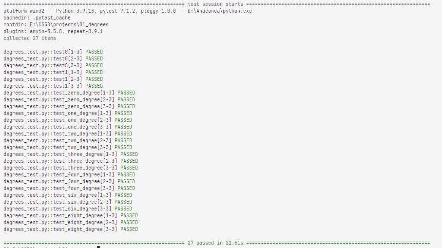
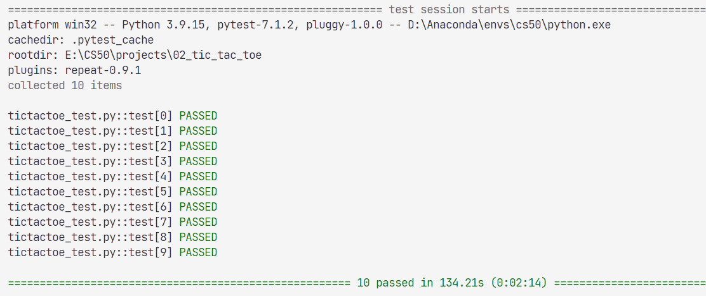
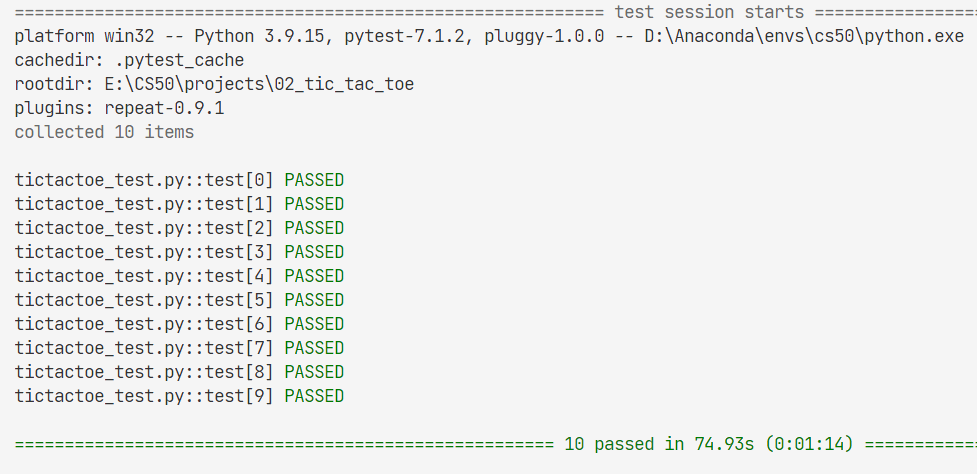
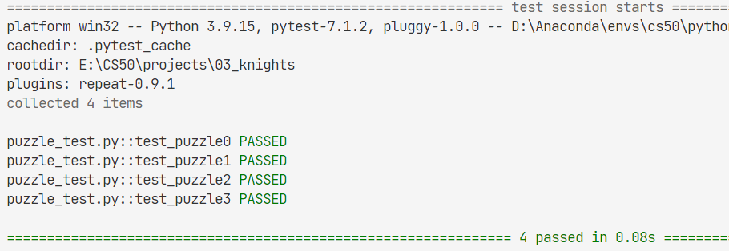
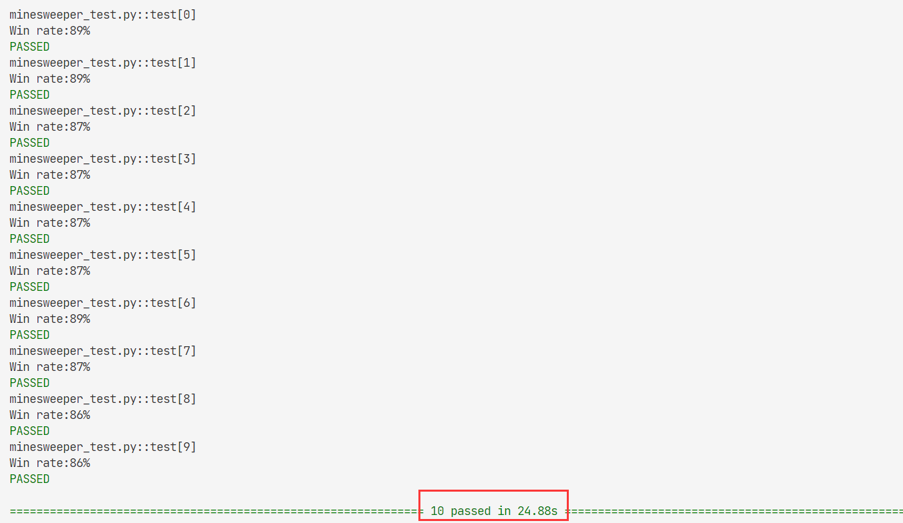

# CS50


# Proj

## 00_pkg

Install all pkg needed to setup.

run:

1. `conda env create -f .\package-list.yaml`

    Using defaul env name: `cs50`

    **Or**

    `conda env create -f .\package-list.yaml -n <new_env_name>`

    Specific the env name

2. **make sure new env is used**

**please ignore other pkg install, if you have run above.**

## 01_degrees

Using the **BFS** method, BFS is always guaranteed to be optimal.

Improv and Fix:

- check whether is target or not, before add node to the frontier
- before add node to the frontier, checking
    
    1. this node is not in the explored for **avoiding the endless loop**
    2. this node is not in the frontier for **avoiding the node.parent and node.action be update causing lenger path.**
- using backtracking for the shortest path
- be careful with `in` and `not in`
- Using `set, dict` other than `list` to **get better perf**

res:



## 02_tic_tac_toe

### 02.1 pkg install

Install pygame: **(Upgrade and just for curr user)**

`python -m pip install -U pygame --user`

test: 

`python -m pygame.examples.aliens`

Uninstall pygame:

`python -m pip uninstall pygame`

ref: [pygame.org](https://www.pygame.org/wiki/GettingStarted)

Or Using `conda` **Recommanded**

1. `conda env create -f .\package-list.yaml`

    Using defaul env name: `cs50`

    **Or**

    `conda env create -f .\package-list.yaml -n <new_env_name>`

    Specific the env name

2. **make sure new env is used**


### 02.2 details

- Using `copy.deepcopy()`

- **Since Tic-Tac-Toe is a tie given optimal play by both sides, you should never be able to beat the AI (though if you don’t play optimally as well, it may beat you!)**

- Alpha-beta pruning is optional, but may make your AI run more efficiently!

res:



res: (**Using Alpha-Beta Pruning**)



## 03_Knights

problem: how to **represent these puzzles using propositional logic**, such that an AI running a **model-checking algorithm** could solve these puzzles for us.

attention:
- printing out **any conclusions** that the model checking algorithm is able to make.
- how to encode information about what the characters actually said.**(biconditional)**

    if the A is knight, then what A said is true,
    else A is not knight, and what A said is false.
- offer **the most direct translation** of the information

    rather than performing logical reasoning on your own
- consider what **the most concise representation** of the information

- **do not miss the easy knowledge e.g. the exclive or(Aknight, Aknave)**

    else, not res, for rules: **under all the models (truth assignments) where the KB is true, R is true as well, then R is res**


res:



## 04_Minesweeper

- **flag a mine** by right-clicking on a cell (or two-finger clicking, depending on the computer).

### 04.1 Knowledge Representation:

if represent knowledge about a Minesweeper game is by **making each cell a propositional variable that is true if the cell contains a mine, and false otherwise.**

then on an 8x8 grid, we’d have **64 variables**, and therefore **2^64 possible models** to check

and the KB is **complicated to expression**.

We need **a better representation of knowledge** for this problem.

before: 

```py
Or(
    And(A, Not(B), Not(C), Not(D), Not(E), Not(F), Not(G), Not(H)),
    And(Not(A), B, Not(C), Not(D), Not(E), Not(F), Not(G), Not(H)),
    And(Not(A), Not(B), C, Not(D), Not(E), Not(F), Not(G), Not(H)),
    And(Not(A), Not(B), Not(C), D, Not(E), Not(F), Not(G), Not(H)),
    And(Not(A), Not(B), Not(C), Not(D), E, Not(F), Not(G), Not(H)),
    And(Not(A), Not(B), Not(C), Not(D), Not(E), F, Not(G), Not(H)),
    And(Not(A), Not(B), Not(C), Not(D), Not(E), Not(F), G, Not(H)),
    And(Not(A), Not(B), Not(C), Not(D), Not(E), Not(F), Not(G), H)
)
```
after: 
```py
{A, B, C, D, E, F, G, H} = 1
```

**rules:**

1. More generally, **any time the number of cells is equal to the count**, we know that all of that sentence’s **cells must be mines**.

2. By extension, **any time we have a sentence whose count is 0**, we know that all of that sentence’s **cells must be safe**.

3. once we know whether a cell is a mine or not, we can **update our sentences to simplify them and potentially draw new conclusions**.
    - C is safe: $\{A, B, C\} = 2 \implies \{A, B\} = 2$
    - C is mine: $\{A, B, C\} = 2 \implies \{A, B\} = 1$

4. any time we have two sentences set1 = count1 and set2 = count2 where **set1 is a subset of set2**, then we can construct the new sentence set2 - set1 = count2 - count1

5. **the cell has been choosen is safe, too**

6. notice the endless loop when getting new sentense

```py
if len(new_knowledge) == 0:
    break
```
7. notice the reentry remove sentense, **Using set other than list** to remove same knowledge

```py
self_knowledge_tmp = set(self.knowledge)
```
8. **the mines should not be in the knowledge set anymore**

```py
neighbor_cells = []
for i in range(cell[0]-1, cell[0]+2):
    for j in range(cell[1]-1, cell[1]+2):
        # simple
        # only include cells whose state is still undetermined in the sentence.
        if (i, j) in self.safes:    # include move has made
            continue
        if (i, j) in self.mines:
            count -= 1
            continue
        if 0 <= i < self.height and 0 <= j < self.width:
            neighbor_cells.append((i, j))
self.knowledge.append(Sentence(neighbor_cells, count))
```

res:




# Test

A nice test framework: [CS50AI-test](https://github.com/jetkan-yk/cs50ai-test)

1. Install pytest:

    `conda install -c anaconda pytest`

2. Install pytest-repeat: 
   
    `conda install -c conda-forge pytest-repeat`

3. Clone repo:

    `git clone https://github.com/jetkan-yk/cs50ai-test`

4. more detail, see [CS50AI-test](https://github.com/jetkan-yk/cs50ai-test)