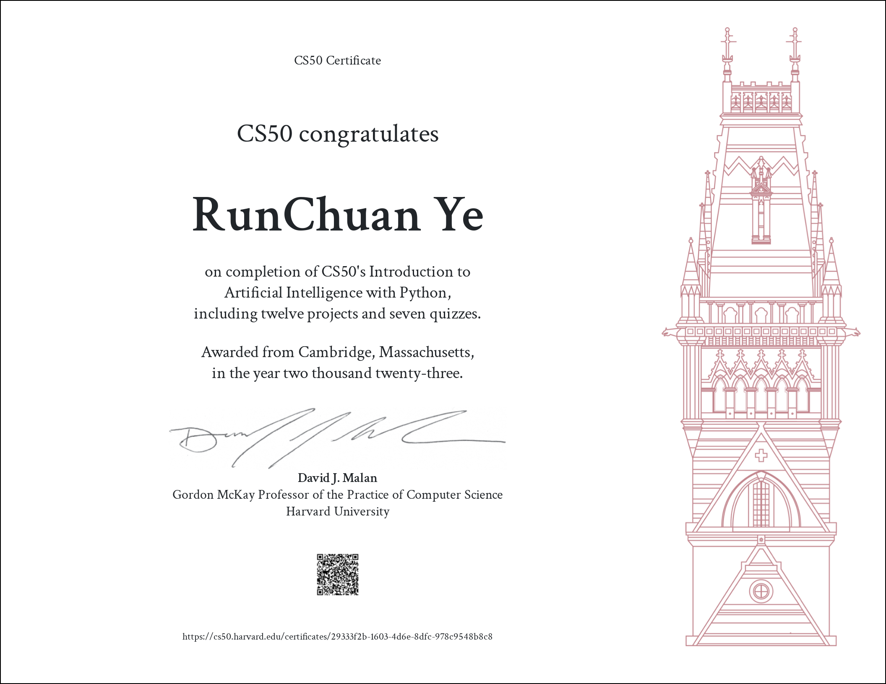

  
Table of Contents

  <ol>
    <li>
        <a href="#about-the-project">About The Project</a>
    </li>
    <li>
        <a href="#env-setup">Env Setup</a>
    </li>
    <li><a href="#labs">Labs</a>
    <li><a href="#test">Test</a>
    </li>
    <li><a href="#acknowledgements">Acknowledgements</a></li>
  </ol>

  
Certificate

   

# About the Project

This project is from Harvard [CS50](https://cs50.harvard.edu/ai/2020/) course.

The repo contains completion of all 12 experiments from it.

# Env Setup

Install all pkgs needed to setup.

run:

1. `conda env create -f .\package-list.yaml`

   Using defaul env name: `cs50`

   **Or**

   `conda env create -f .\package-list.yaml -n <new_env_name>`

   Specific the env name
2. **make sure new env is used**

**please ignore other pkgs installation, if you have run cmd above.**

# Labs

| Lecture            | Lab             | Repo            | Test                                         |
| ------------------ | --------------- | --------------- | -------------------------------------------- |
| [0.Search](./notes/lecture0.md)          | [degrees.py](./projects/01_degrees/degrees.py)     | [01_Degrees](./reports/01_degrees.md)     | <b style="color: #4F7942" >Pass </b> |
| [0.Search](./notes/lecture0.md)          | [tictactoe.py](./projects/02_tic_tac_toe/tictactoe.py) | [02_Tic_Tac_Toe](./reports/02_tic_tac_toe.md) | <b style="color: #4F7942" >Pass </b> |
| [1.Knowledge](./notes/lecture1.md)       | [puzzle.py](./projects/03_knights/puzzle.py)     | [03_Knights](./reports/03_knights.md)     | <b style="color: #4F7942" >Pass </b> |
| [1.Knowledge](./notes/lecture1.md)       | [minesweeper.py](./projects/04_minesweeper/minesweeper.py) | [04_Minesweeper](./reports/04_minesweeper.md) | <b style="color: #4F7942" >Pass </b> |
| [2.Uncertainty](./notes/lecture2.md)     | [pagerank.py](./projects/05_pagerank/pagerank.py)    | [05_Pagerank](./reports/05_pagerank.md)    | <b style="color: #4F7942" >Pass </b> |
| [2.Uncertainty](./notes/lecture2.md)     | [heredity.py](./projects/06_heredity/heredity.py)    | [06_Heredity](./reports/06_heredity.md)    | <b style="color: #4F7942" >Pass </b> |
| [3.Optimization](./notes/lecture3.md)    | [generate.py](./projects/07_crossword/generate.py)   | [07_Crossword](./reports/07_crossword.md)   | <b style="color: #4F7942" >Pass </b> |
| [4.Learning](./notes/lecture4.md)        | [shopping.py](./projects/08_shopping/shopping.py)    | [08_Shopping](./reports/08_shopping.md)    | <b style="color: #4F7942" >Pass </b> |
| [4.Learning](./notes/lecture4.md)        | [nim.py](./projects/09_nim/nim.py)         | [09_Nim](./reports/09_nim.md)         | <b style="color: #4F7942" >Pass </b> |
| [5.Neural_Networks](./notes/lecture5.md) | [traffic.py](./projects/10_traffic/traffic.py)     | [10_Traffic](./reports/10_traffic.md)     | N/A                                          |
| [6.Lauguage](./notes//lecture6.md)        | [parser.py](./projects/11_parser/parser.py)      | [11_Parser](./reports/11_parser.md)      | N/A                                          |
| [6.Lauguage](./notes/lecture6.md)        | [questions.py](./projects/12_questions/questions.py)   | [12_Questions](./reports/12_question.md)   | N/A                                          |

# Test

A nice test framework: [CS50AI-test](https://github.com/jetkan-yk/cs50ai-test)

1. Install pytest:

   `conda install -c anaconda pytest`
2. Install pytest-repeat:

   `conda install -c conda-forge pytest-repeat`
3. Clone repo:

   `git clone https://github.com/jetkan-yk/cs50ai-test`
4. more detail, see [CS50AI-test](https://github.com/jetkan-yk/cs50ai-test)

# Acknowledgements

- [CS50AI-test](https://github.com/jetkan-yk/cs50ai-test)
