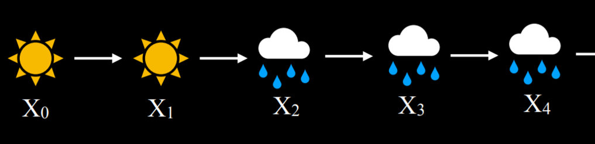

# 2.Uncertainty

how we can create AI that **makes optimal decisions** given **limited information** and .**uncertainty**.

## 2.1 Probability

## 2.2 Conditional Probability

AI can use partial information to make educated guesses about the future.

To use this information, which affects the probability that the event occurs in the future, we rely on **conditional probability**.

## 2.3 Random Variables

### 2.3.1 Independence

events a and b are **independent** if and only if the probability of a and b is equal to the probability of a times the probability of b: P(a ∧ b) = P(a)P(b).

if 
- $P(a \wedge b)=P(a) P(b \mid a)$

- $P(a \wedge b)=P(a) P(b)$

then
- $P(b \mid a)=P(b)$

**independence**

## 2.4 Bayes’ Rule

## 2.5 Joint Probability

how can we say whether clouds in the morning are related to the likelihood of rain in the afternoon. **Using the Joint Probability and Bayes' Rule.**

Using joint probabilities, we can deduce conditional probability.

For example, if we are interested in the probability distribution of clouds in the morning given rain in the afternoon. **P(C | rain) = P(C, rain)/P(rain)** (a side note: in probability, commas and ∧ are used interchangeably. Thus, **P(C, rain) = P(C ∧ rain)**). In words, we divide the joint probability of rain and clouds by the probability of rain.

In the last equation, it is possible to view P(rain) as some constant by which P(C, rain) is multiplied. Thus, **we can rewrite P(C, rain)/P(rain) = αP(C, rain), or α<0.08, 0.02>**. Factoring out α leaves us with the proportions of the probabilities of the possible values of C given that there is rain in the afternoon. Namely, if there is rain in the afternoon, the proportion of the probabilities of clouds in the morning and no clouds in the morning is 0.08:0.02. Note that 0.08 and 0.02 don’t sum up to 1; however, since this is the probability distribution for the random variable C, we know that they should sum up to 1. Therefore, we need to **normalize the values by computing α such that α0.08 + α0.02 = 1**. Finally, we can say that P(C | rain) = <0.8, 0.2>.

## 2.6 Probability Rules

- Negation: P(¬a) = 1 - P(a). 
- Inclusion-Exclusion: P(a ∨ b) = P(a) + P(b) - P(a ∧ b). 
- Marginalization: P(a) = P(a, b) + P(a, ¬b). 

    $P\left(X=x_{i}\right)=\sum_{j} P\left(X=x_{i}, Y=y_{j}\right)$

- Conditioning: P(a) = P(a | b)P(b) + P(a | ¬b)P(¬b).

    $P\left(X=x_{i}\right)=\sum_{j} P\left(X=x_{i} \mid Y=y_{j}\right) P\left(Y=y_{j}\right)$

## 2.7 Bayesian Networks

A Bayesian network is a data structure that **represents the dependencies among random variables**. Bayesian networks have the following properties:

- They are **directed** graphs.
- Each **node** on the graph **represent a random variable**.
- An arrow from X to Y represents that X is a parent of Y. That is, the probability distribution of Y depends on the value of X.
- Each node X has probability distribution P(X | Parents(X)).

if we want to find the probability of missing the meeting when the train was delayed on a day with no maintenance and light rain, or **P(light, no, delayed, miss)**, we will compute the following: **P(light)P(no | light)P(delayed | light, no)P(miss | delayed)**. The value of each of the individual probabilities can be found in the probability distributions above, and then these values are multiplied to produce P(no, light, delayed, miss)

**why?**

### 2.7.1 Inference

We can also infer new information based on probabilities. While this does not allow us to know new information for certain, it allows us to figure out the **probability distributions for some values**. 

Inference has multiple properties.

- Query X: the variable for which we want to **compute the probability distribution**.
- Evidence variables E: one or more variables that have been observed for event e. For example, we might have observed that there is light rain, and this observation helps us compute the probability that the train is delayed.
- Hidden variables Y: variables that aren’t the query and also haven’t been observed. For example, standing at the train station, we can observe whether there is rain, but we can’t know if there is maintenance on the track further down the road. Thus, Maintenance would be a hidden variable in this situation.
- **The goal: calculate P(X | e)**, that is P(X | E). For example, compute the probability distribution of the Train variable (the query) based on the evidence e that we know there is light rain.

#### 2.7.1.1 Inference by Enumeration

Inference by enumeration is a process of finding the probability distribution of variable X given observed evidence e and some hidden variables Y.

Let’s take an example. We want to compute the probability distribution of the Appointment variable given the evidence that there is light rain and no track maintenance. That is, we know that there is light rain and no track maintenance, and we want to figure out what are the probabilities that we attend the appointment and that we miss the appointment, P(Appointment | light, no). from the joint probability section, we know that we can express the possible values of the Appointment random variable as a proportion, rewriting P(Appointment | light, no) as αP(Appointment, light, no). How can we calculate the probability distribution of Appointment if its parent is only the Train variable, and not Rain or Maintenance? Here, we will use marginalization. The value of P(Appointment, light, no) is equal to α[P(Appointment, light, no, delayed) + P(Appointment, light, no, on time)].

$\mathbf{P}(\mathrm{X} \mid \mathbf{e})=\alpha \mathbf{P}(\mathrm{X}, \mathbf{e})=\alpha \sum_{\mathbf{y}} \mathbf{P}(\mathrm{X}, \mathbf{e}, \mathbf{y})$

In this equation, 
- X stand for the query variable,
- e for the observed evidence,
- y for all the values of the hidden variables,
- and α normalizes the result such that we end up with probabilities that add up to 1.

**Goal: get the X's distribution**

**so, we should get the joint distribution of all variables first!**

To explain the equation in words, it is saying that the probability distribution of X given e is equal to a normalized probability distribution of X and e. To get to this distribution, we sum the normalized probability of X, e, and y, **where y takes each time a different value of the hidden variables Y**. **Y is a set of variables, and each time y is a set of values, not a scalar.**

However, Inference by enumeration of computing probability is inefficient, especially when there **are many variables in the model**. A different way to go about this would be **abandoning exact inference in favor of approximate inference**. Doing this, we lose some precision in the generated probabilities, but often this imprecision is negligible. Instead, we gain a scalable method of calculating probabilities.

#### 2.7.1.2 Sampling

Sampling is one technique of **approximate inference**.

In sampling, each variable is sampled for a value according to its probability distribution.

**a method kind of Simulation:**

Here is an example from lecture: if we start with sampling the Rain variable, the value none will **be generated** with probability of 0.7, the value light will be generated with probability of 0.2, and the value heavy will be generated with probability of 0.1. Suppose that the sampled value we get is none. When we get to the Maintenance variable, we sample it, too, **but only from the probability distribution where Rain is equal to none**, because this is an already sampled result. We will continue to do so through all the nodes. Now we have one sample, and repeating this process multiple times generates a distribution. Now, if we want to answer a question, such as what is P(Train = on time), we can count the number of samples where the variable Train has the value on time, and divide the result by the total number of samples. This way, we have just generated an approximate probability for P(Train = on time).

We can also **answer questions that involve conditional probability, such as P(Rain = light | Train = on time)**. In this case, we ignore all samples where the value of Train is not on time, and then proceed as before. We count how many samples have the variable Rain = light among those samples that have Train = on time, and then divide by the total number of samples where Train = on time.

**Likelihood Weighting:**

In the sampling example above, **we discarded the samples that did not match the evidence that we had**. This is inefficient. One way to get around this is with likelihood weighting, using the following steps:

- Start by fixing the values for evidence variables.
- Sample the non-evidence variables using conditional probabilities in the Bayesian network.
- Weight each sample by its likelihood: the probability of all the evidence occurring. (weight: P(evidence variables | parent variables))

For example, if we have the observation that the train was on time, we will start sampling as before. We sample a value of Rain given its probability distribution, then Maintenance, but when we get to Train - we always give it the observed value, in our case, on time. **Then we proceed and sample Appointment based on its conditional probability distribution given Train = on time.** Now that this sample exists, we weight it by the conditional probability of the observed variable given its sampled parents. That is, if we sampled Rain and got light, and then we sampled Maintenance and got yes, then we will weight this sample by P(Train = on time | light, yes).

then ?

P(attend) = (attend weight sum) / (all weight sum)

## 2.8 Markov Models

So far, we have looked at questions of probability given some information that we observed. In this kind of paradigm, the dimension of time is not represented in any way. **However, many tasks do rely on the dimension of time, such as prediction**. To represent the variable of time we will create a new variable, X, and change it based on the event of interest, such that Xₜ is the current event, Xₜ₊₁ is the next event, and so on. To be able to **predict events** in the future, we will use Markov Models.

### 2.8.1 The Markov Assumption

The Markov assumption is an assumption that the current state depends on only a finite fixed number of previous states. 

This is important to us. Think of the task of predicting weather. In theory, we could use all the data from the past year to predict tomorrow’s weather. However, it is infeasible,
1. **because of the computational power this would require**
2. and because there is probably **no information** about the conditional probability of tomorrow’s weather based on the weather 365 days ago.

Using the Markov assumption, we restrict our previous states (e.g. how many previous days we are going to consider when predicting tomorrow’s weather), thereby making the task manageable.

This means that we might get a more rough approximation of the probabilities of interest, but this is often good enough for our needs. **Moreover, we can use a Markov model based on the information of the one last event (only one step)** (e.g. predicting tomorrow’s weather based on today’s weather).

### 2.8.2 Markov Chain

A Markov chain is a sequence of random **variables** where the distribution of each variable follows the Markov assumption. That is, each event in the chain occurs based on the probability of the event before it.

To start constructing a Markov chain, need transition model.

**transition model:** 
will specify the the probability distributions of the next event based on the possible values of the current event.

Start with a day being either rainy or sunny, and then sample the next day based on the probability of it being sunny or rainy given the weather today. Then, condition the probability of the day after tomorrow based on tomorrow, and so on, resulting in a Markov chain:

### 2.8.3 Hidden Markov Models

A hidden Markov model is a type of a Markov model for a system with hidden states that generate some observed event. This means that sometimes, the AI has some measurement of the world but no access to the precise state of the world. In these cases, the state of the world is called the **hidden state** and whatever data the AI has access to are the **observations**. Here are a few examples for this:

- For a robot exploring uncharted territory, the hidden state is its position, and the observation is the data recorded by the robot’s sensors.
- In speech recognition, the hidden state is the words that were spoken, and the observation is the audio waveforms.
- When measuring user engagement on websites, the hidden state is how engaged the user is, and the observation is the website or app analytics.

For our discussion, we will use the following example. Our AI wants to infer the weather (the hidden state), but it only has access to an indoor camera that records how many people brought umbrellas with them. Here is our **sensor model** (also called **emission model**) that represents these probabilities:

**Sensor Markov Assumption**

**The assumption that the evidence variable depends only on the corresponding state.** 

For example, for our models, we assume that whether people bring umbrellas to the office depends only on the weather. This is not necessarily reflective of the complete truth, because, for example, more conscientious, rain-averse people might take an umbrella with them everywhere even when it is sunny, and if we knew everyone’s personalities it would add more data to the model. However, **the sensor Markov assumption ignores these data, assuming that only the hidden state affects the observation.**

A hidden Markov model can be represented in a Markov chain with two layers. The top layer, variable X, stands for the hidden state. The bottom layer, variable E, stands for the evidence, the observations that we have.

Based on hidden Markov models, multiple tasks can be achieved:

- Filtering: given observations from start until now, calculate the probability distribution for the current state. For example, given information on when people bring umbrellas form the start of time until today, we generate a probability distribution for whether it is raining **today** or not.
- Prediction: given observations from start until now, calculate the probability distribution for a **future** state.
- Smoothing: given observations from start until now, calculate the probability distribution for a past state. For example, calculating the probability of rain **yesterday** given that people brought umbrellas **today?**.
- Most likely explanation: given observations from start until now, calculate most likely **sequence** of events.

The most likely explanation task can be used in processes such as **voice recognition**, where, based on multiple waveforms, the AI infers the most likely sequence of words or syllables that brought to these waveforms. 

