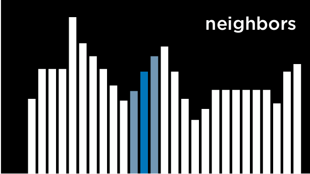

# 3.Optimization

Optimization is choosing the best option from a set of possible options. We have already encountered problems where we tried to find the best possible option, such as in the **minimax algorithm**, and today we will learn about tools that we can use to **solve an even broader range of problems.**

To summarize, optimization problems can be formulated in multiple ways. Today we considered 
- local search
- linear programming
- constraint satisfaction.

## 3.1 Local Search

Local search is a search algorithm that maintains a single node and searches by moving to a neighboring node. This type of algorithm is different from previous types of search that we saw. Whereas in maze solving, for example, we wanted to find the quickest way to the goal, **local search is interested in finding the best answer to a question**. Often, **local search will bring to an answer that is not optimal but “good enough,” conserving computational power.** Consider the following example of a local search problem: we have four houses in set locations. We want to build two hospitals, such that we minimize the distance from each house to a hospital. This problem can be visualized as follows:


- The distance between them is measured using **Manhattan distance** (number of moves up, down, and to the sides),
- and the sum of the distances from each house to the nearest hospital is 17. We call this the **cost**, because we try to **minimize this distance**. In this case, **a state** would be any one configuration of houses and hospitals.

represent each configuration of houses and hospitals as the **state-space landscape** below. Each of the bars in the picture represents a value of a state, which in our example would be the cost of a certain configuration of houses and hospitals.




Note that the way local search algorithms work is by **considering one node in a current state, and then moving the node to one of the current state’s neighbors**. This is unlike the minimax algorithm, for example, where **every single state in the state space was considered recursively**.

a few important terms:
- An **Objective Function** is a function that we use to maximize the value of the solution.
- A **Cost Function** is a function that we use to minimize the cost of the solution (this is the function that we would use in our example with houses and hospitals. We want to minimize the distance from houses to hospitals).
- A **Current State** is the state that is currently being considered by the function.
- A **Neighbor State** is a state that the current state can transition to. In the one-dimensional state-space landscape above, a neighbor state is the state to either side of the current state. In our example, a neighbor state could be the state resulting from moving one of the hospitals to any direction by one step. Neighbor states are usually similar to the current state, and, therefore, their values are close to the value of the current state.


### 3.1.1 Hill Climbing

Hill climbing is **one type of a local search algorithm**. In this algorithm, the neighbor states are compared to the current state, and **if any of them is better**, **we change the current node from the current state to that neighbor state**.

What qualifies as better is defined by whether we use **an objective function, preferring a higher value**, or **a decreasing function, preferring a lower value**.

A hill climbing algorithm will look the following way in pseudocode:

```
function Hill-Climb(problem):
    current = initial state of problem
    repeat:
        neighbor = best valued neighbor of current
        if neighbor not better than current:
            return current
        current = neighbor
```

In this algorithm, we start with a current state. 
- In some problems, we will **know what the current state is**
- in others, we will have to **start with selecting one randomly**.

Using the hill climbing algorithm, we can start to improve the locations that we assigned to the hospitals in our example. After a few transitions, we get to the following state:


However, **this is not the optimal state** just yet. For example, moving the hospital on the left to be underneath the top left house would bring to a cost of 9, which is better than 11. However, this version of a hill climbing algorithm can’t get there, because all the neighbor states are at least as costly as the current state. In this sense, **a hill climbing algorithm is short-sighted, often settling for solutions that are better than some others, but not necessarily the best of all possible solutions.**

**cons:**

**it may end up in local minima and maxima.** Once the algorithm reaches a point whose neighbors are worse, for the function’s purpose, than the current state, the algorithm stops. 

**pros:**

Although local search algorithms don’t always give the best possible solution, they can **often give a good enough solution** in situations where considering every possible state is computationally infeasible.

#### 3.1.1.1 Local and Global Minima and Maxima

As mentioned above, **a hill climbing algorithm can get stuck in local maxima or minima**.

**A local maximum** (plural: maxima) is a state that has a higher value than its neighboring states. As opposed to that, **a global maximum** is a state that has the highest value of **all states in the state-space.**
e.g.


In contrast, **a local minimum** (plural: minima) is a state that has a lower value than its neighboring states. As opposed to that, **a global minimum** is a state that has the lowest value of **all states in the state-space**.


The problem with hill climbing algorithms is that they may end up in local minima and maxima. Once the algorithm reaches a point whose neighbors are worse, for the function’s purpose, than the current state, the algorithm stops.

**Special types of local maxima and minima include the flat local maximum/minimum**, where multiple states of equal value are adjacent, forming **a plateau** whose neighbors have a worse value, and **the shoulder**, where multiple states of equal value are adjacent and the neighbors of the plateau can be both better and worse.

Starting from the **middle** of the plateau, the algorithm will not be able to advance in any direction.


#### 3.1.1.2 Hill Climbing Variants

Due to the limitations of Hill Climbing, multiple variants have been thought of to **overcome the problem of being stuck in local minima and maxima.**

What all variations of the algorithm have in common is that, no matter the strategy, **each one still has the potential of ending up in local minima and maxima and no means to continue optimizing.**

The algorithms below are phrased such that a higher value is better, but they also apply to cost functions, where the goal is to minimize cost.

- **Steepest-ascent**: choose the highest-valued neighbor. This is the standard variation that we discussed above.
- **Stochastic**: choose randomly from higher-valued neighbors. Doing this, we choose to go to **any direction** that improves over our value. This makes sense if, for example, the highest-valued neighbor leads to a local maximum while another neighbor leads to a global maximum.
- **First-choice**: choose the first higher-valued neighbor.
- **Random-restart**: conduct hill climbing multiple times. Each time, start from a random state. Compare the maxima from every trial, and choose the highest amongst those.
- **Local Beam Search**: chooses the k highest-valued neighbors. This is unlike most local search algorithms in that it **uses multiple nodes for the search, and not just one**.

## 3.2 Simulated Annealing

Although we have seen **variants** that can improve hill climbing, **they all share the same fault: once the algorithm reaches a local maximum, it stops running.**

**Simulated annealing allows the algorithm to “dislodge” itself if it gets stuck in a local maximum.**

Annealing is the process of heating metal and allowing it to cool slowly, which serves to toughen the metal.

This is used as a metaphor for the simulated annealing algorithm, which starts with a high temperature, being **more likely** to make **random decisions**, and, as the temperature decreases, it becomes **less likely** to make **random decisions**, becoming **more “firm.”**

**This mechanism allows the algorithm to change its state to a neighbor that’s worse than the current state**, which is how it can escape from local maxima.

The following is pseudocode for simulated annealing:**(modified)**
```
function Simulated-Annealing(problem, max):
    current = initial state of problem
    for t = 1 to max:
        T = Temperature(t)
        neighbor = random neighbor of current
        ΔE = how much better neighbor is than current
        if ΔE > 0:
            current = neighbor
        else:
            with probability e^(ΔE/T) set current = neighbor
    return current
```

note:

- max:  the number of times it should repeat itself
- Temperature(t): This function return a higher value in the early iterations (when t is low) and a lower value in later iterations (when t is high). 


- If the neighbor state is better than the current state (ΔE > 0), as before, we set our current state to be the neighbor state.

- However, when the neighbor state is worse (ΔE < 0), we still might set our current state to be that neighbor state, and we do so with probability e^(ΔE/T). 

    The idea here is that **a more negative ΔE** will result in **lower probability** of the neighbor state being chosen, and **the higher the temperature** T **the higher the probability** that the neighbor state will be chosen.

    This means that **the worse the neighbor state, the less likely it is to be chosen**, and **the earlier the algorithm is in its process, the more likely it is to set a worse neighbor state as current state**.
    
    The math behind this is as follows: e is a constant (around 2.72), and **ΔE is negative (since this neighbor is worse than the current state)**. The more negative ΔE, the closer the resulting value to 0. The higher the temperature T is, the closer ΔE/T is to 0, making the probability closer to 1.

### 3.2.1 Traveling Salesman Problem

In the traveling salesman problem, the task is to **connect all points while choosing the shortest possible distance**. This is, for example, what delivery companies need to do: **find the shortest route from the store to all the customers’ houses and back.**


In this case, **a neighbor state might be seen as a state where two arrows swap places**.

Calculating every possible combination makes this problem computationally demanding (having just 10 points gives us 10!, or **3,628,800 possible routes**).

By using the simulated annealing algorithm, **a good solution can be found for a lower computational cost.**

## 3.3 Linear Programming

Linear programming is a family of problems that **optimize a linear equation** (an equation of the form y = ax₁ + bx₂ + …).

Linear programming will have the following components:

- **A cost function** that we want to **minimize**: c₁x₁ + c₂x₂ + … + cₙxₙ. Here, each x₋ is a variable and it is associated with some cost c₋.
- **A constraint** that’s represented as a sum of variables that is either less than or equal to a value (a₁x₁ + a₂x₂ + … + aₙxₙ ≤ b) **(It needs to be multiplied by - 1, if it is greater than or equal to)** or precisely equal to this value (a₁x₁ + a₂x₂ + … + aₙxₙ = b). In this case, x₋ is a variable, and a₋ is some resource associated with it, and b is how much resources we can dedicate to this problem.
- **Individual bounds** on variables (for example, that a variable can’t be negative) of the form lᵢ ≤ xᵢ ≤ uᵢ.

note:

- Linear programming means that **the power of the parameters to be optimized** is 1, not x (so-called variable)

```py
import scipy.optimize

# Objective Function: 50x_1 + 80x_2
# Constraint 1: 5x_1 + 2x_2 <= 20
# Constraint 2: -10x_1 + -12x_2 <= -90

result = scipy.optimize.linprog(
    [50, 80],  # Cost function: 50x_1 + 80x_2
    A_ub=[[5, 2], [-10, -12]],  # Coefficients for inequalities
    b_ub=[20, -90],  # Constraints for inequalities: 20 and -90
)

if result.success:
    print(f"X1: {round(result.x[0], 2)} hours")
    print(f"X2: {round(result.x[1], 2)} hours")
else:
    print("No solution")
```


## 3.4 Constraint Satisfaction

Constraint Satisfaction problems are a class of problems where **variables need to be assigned values while satisfying some conditions.**

Constraints satisfaction problems have the following properties:

- Set of variables (x₁, x₂, …, xₙ)
- Set of **domains** for each variable {D₁, D₂, …, Dₙ}
- Set of constraints C

**Sudoku** can be represented as a constraint satisfaction problem, where
- each empty square is a variable 
- the domain is the numbers 1-9
- the constraints are the squares that can’t be equal to each other.

Consider another example.

Each of students 1-4 is taking three courses from A, B, …, G.

Each course needs to have an exam, and the possible days for exams are Monday, Tuesday, and Wednesday. However, the same student can’t have two exams on the same day.

In this case, 
- the variables are the courses
- the domain is the days
- the constraints are which courses can’t be scheduled to have an exam on the same day because the same student is taking them

This problem can be solved using constraints that are **represented as a graph**.
-  Each node on the graph is a course
-  an edge is drawn between two courses if they can’t be scheduled on the same day. 


A few more terms worth knowing about constraint satisfaction problems:

- **A Hard Constraint** is a constraint that must be satisfied in a correct solution.
- **A Soft Constraint** is a constraint that expresses which solution is preferred over others.
- **A Unary Constraint** is a constraint that involves only one variable. In our example, a unary constraint would be saying that course A can’t have an exam on Monday {A ≠ Monday}.
- **A Binary Constraint** is a constraint that involves two variables. This is the type of constraint that we used in the example above, saying that **some two courses can’t have the same value** {A ≠ B}.

### 3.4.1 Node Consistency

Node consistency is when **all the values in a variable’s domain satisfy the variable’s unary constraints.**

For example, let’s take two courses, A and B. 
- The domain for each course is {Monday, Tuesday, Wednesday}
- the constraints are {A ≠ Mon, B ≠ Tue, B ≠ Mon, A ≠ B}.

Now, **neither A nor B is consistent**, because the existing constraints prevent them from being able to take every value that’s in their domain.

However, if we **remove Monday from A’s domain**, then it will have node consistency. To achieve node consistency in B, we will have to **remove both Monday and Tuesday from its domain**.

### 3.4.2 Arc Consistency

Arc consistency is when **all the values in a variable’s domain satisfy the variable’s binary constraints** (note that we are now **using “arc” to refer to what we previously referred to as “edge”**).

In other words, to make X arc-consistent with respect to Y, remove elements from X’s domain until **every choice for X has a possible choice for Y**.

Consider our previous example with the revised domains: A:{Tuesday, Wednesday} and B:{Wednesday}.

For A to be arc-consistent with B, no matter what day A’s exam gets scheduled (from its domain), B will still be able to schedule an exam. Is A arc-consistent with B?

If A takes the value Tuesday, then B can take the value Wednesday. However, if A takes the value Wednesday, then there is no value that B can take (remember that one of the constraints is A ≠ B).Therefore, **A is not arc-consistent with B**. 

To change this, we can **remove Wednesday from A’s domain**. Then, any value that A takes (Tuesday being the only option) leaves a value for B to take (Wednesday). **Now, A is arc-consistent with B.**

Let’s look at an algorithm in pseudocode that **makes a variable arc-consistent with respect to some other variable** (note that csp stands for “constraint satisfaction problem”).

make the X arc-consistent with respect to Y.

```py
function Revise(csp, X, Y):
    revised = false
    for x in X.domain:
        if no y in Y.domain satisfies constraint for (X,Y):
            delete x from X.domain
            revised = true
    return revised
```

Often we are interested in **making the whole problem arc-consistent** and not just one variable with respect to another. In this case, we will use an algorithm called **AC-3**, which uses Revise:
```py

function AC-3(csp):
    queue = all arcs in csp
    while queue non-empty:
        (X, Y) = Dequeue(queue)
        if Revise(csp, X, Y):
            if size of X.domain == 0:
                return false
            for each Z in X.neighbors - {Y}:
                Enqueue(queue, (Z,X))
    return true
```
note:
- Each time it considers **an** arc, and **removes it** from the queue
- returen false: this constraint satisfaction problem is **unsolvable**
- **since X’s domain was changed, we need to see if all the arcs associated with X are still consistent.**


**cons:**

While the algorithm for arc consistency can simplify the problem, **it will not necessarily solve it**, since it considers **binary constraints only and not how multiple nodes might be interconnected**. Our previous example, where **each of 4 students is taking 3 courses, remains unchanged by running AC-3 on it.**

consider every arc in the graph in the below img, AC-3 will not remove any value in any domain, for there are 3 values in each domain, and only 2 node considered.

e.g., for A chooses the Mon/Thu/Wed, there are always 2 values remained for B to choose from.

that is, for all the node-pair, they are arc-consistency even without AC-3.


**solve:**

A constraint satisfaction problem can be seen as a **search problem**:

- **Initial state**: empty assignment (all variables don’t have any values assigned to them).
- **Actions**: add a {variable = value} to assignment; that is, give some variable a value.
- **Transition model**: shows how adding the assignment changes the assignment. There is not much depth to this: the transition model **returns the state that includes the assignment following the latest action.**
- **Goal test**: check if all variables are assigned a value and all constraints are satisfied.
- **Path cost function**: all paths have **the same cost**. As we mentioned earlier, as opposed to typical search problems, optimization problems **care about the solution and not the route to the solution.**

However, going about a constraint satisfaction problem naively, as a **regular search problem**, is **massively inefficient**.

Instead, we can make use of the **structure** of a constraint satisfaction problem to solve it more **efficiently**.

### 3.4.3 Backtracking Search

Backtracking search is a type of a search algorithm that takes into account the **structure** of a constraint satisfaction search problem.

In general, it is a **recursive function** that attempts to continue assigning values as long as they satisfy the constraints. If constraints are violated, it tries a different assignment.

```
function Backtrack(assignment, csp):
    if assignment complete:
        return assignment
    var = Select-Unassigned-Var(assignment, csp)
    for value in Domain-Values(var, assignment, csp):
        if value consistent with assignment:
            add {var = value} to assignment
            result = Backtrack(assignment, csp)
            if result ≠ failure:
                return result
            remove {var = value} from assignment
    return failure
```
#### 3.4.3.9 Enhance Backtracking Search 

1. [Maintaining Arc-Consistency](#344-inference-maintaining-arc-consistency)
2. [Minimum Remaining Values (MRV)](#345-minimum-remaining-values-mrv)
3. [Degree heuristic](#346-degree-heuristic)
4. [Least Constraining Values](#347-least-constraining-values)

### 3.4.4 Inference (Maintaining Arc-Consistency)

Although **backtracking search** is more efficient than simple search, it **still takes a lot of computational power**. 

**Enforcing arc consistency**, on the other hand, is **less resource intensive**. 

By **interleaving backtracking search with inference (enforcing arc consistency), we can get at a more efficient algorithm**.

This algorithm is called the **Maintaining Arc-Consistency algorithm**. This algorithm will enforce arc-consistency after every new assignment of the backtracking search.

Specifically, after we make a new assignment to X, we will call the AC-3 algorithm and start it with a queue of all arcs (Y,X) where Y is a neighbor of X (and **not a queue of all arcs in the problem**). Following is a revised Backtrack algorithm that maintains arc-consistency, with the new additions in bold.

```
function Backtrack(assignment, csp):
    if assignment complete:
        return assignment
    var = Select-Unassigned-Var(assignment, csp)
    for value in Domain-Values(var, assignment, csp):
        if value consistent with assignment:
            add {var = value} to assignment

+            inferences = Inference(assignment, csp)
+            if inferences ≠ failure:
+                add inferences to assignment
            
            result = Backtrack(assignment, csp)
            if result ≠ failure:
                return result
            
-            remove {var = value} from assignment
+            remove {var = value} and inferences from assignment
    return failure
```

note:
- **Inference function**: Specifically, after we make a new assignment to X, we will call the AC-3 algorithm and start it with a queue of all arcs (Y,X) where Y is a neighbor of X (and **not a queue of all arcs in the problem**). 
- add all vars that have only one value to choose from to the inferences set(the val Inference funciton return.). 


There are additional ways to make the algorithm more efficient. So far, we **selected an unassigned variable randomly**. However, some choices are more likely to bring to a solution **faster** than others. 

This requires the **use of heuristics**. A heuristic is a rule of thumb, meaning that, **more often than not**, it will bring to **a better result** than following a naive approach, but it is **not guaranteed** to do so.

### 3.4.5 Minimum Remaining Values (MRV) 

Minimum Remaining Values (MRV) is one such heuristic.

The idea here is that if a variable’s domain was constricted by inference, and now it has **only one value left** (**or even if it’s two values**), then by **making this assignment** we will **reduce the number of backtracks** we might need to do later.

That is, **we will have to make this assignment sooner or later**, **since it’s inferred from enforcing arc-consistency**. If this assignment brings to failure, it is better to find out about it as soon as possible and not backtrack later.

### 3.4.6 Degree heuristic 

The **Degree heuristic** relies on the degrees of variables, where **a degree is how many arcs connect a variable to other variables.** By choosing the variable with the highest degree, with one assignment, **we constrain multiple other variables, speeding the algorithm’s process.**


For example, **all the variables above have domains of the same size**. Thus, we should pick a domain with the **highest degree**, which would be variable E.


note:
1. MRV first
2. Degree heurisitc second
3. select a node satisfing 1. and 2. randomly


Both heuristics are not always applicable. For example, when **multiple variables** have the **same least number** of values in their domain, or when **multiple variables** have the **same highest degree**.

### 3.4.7 Least Constraining Values

Another way to make the algorithm **more efficient** is employing yet another heuristic when **we select a value from the domain of a variable**.

Here, we would like to use the **Least Constraining Values heuristic**, where we select the value that **will constrain the least other variables**. 

The idea here is that, while in the degree heuristic we wanted to use the variable that is **more likely to constrain other variables**, here we want this variable to place the **least constraints on other variables**.

note: 
1. That is, we want to **locate** what could be the** largest potential source of trouble** (the variable with the highest degree), and
2. **then render it the least troublesome that we can** (assign the least constraining value to it).

For example, let’s consider variable C. If we assign Tuesday to it, we will put a constraint on all of **B, E, and F**. However, if we choose Wednesday, we will put a constraint **only on B and E.** Therefore, it is **probably better to go with Wednesday**.

