# 4.Learning

## 4.1 Machine Learning

### 4.1.1 Supervised Learning

Supervised learning is a task where a computer learns a function that **maps inputs to outputs** **based on a dataset of input-output pairs**.

There are multiple tasks under supervised learning, and one of those is **Classification**.

This is a task where the function **maps an input to a discrete output**.

This **function is hidden from us**, and **it is probably affected by many other variables that we don’t have access to.**

e.g.

Our goal is to create function h(humidity, pressure) that can **approximate** the behavior of function f, to maps the input to a discrete value, either Rain or No Rain.

#### 4.1.1.1 Classification

##### 4.1.1.1.1 Nearest-Neighbor Classification

One way of solving a task like the one described above is by assigning the variable in question the value of **the closest observation**.

One way to **get around the limitations of nearest-neighbor classification** is by using **k-nearest-neighbors classification**, where the dot is colored based on the most frequent color of the k nearest neighbors.

A **drawback** of the k-nearest-neighbors classification is that, using a naive approach, the algorithm will **have to measure the distance of every single point to the point in question**, which is computationally expensive.

This can be **sped up by using data structures** that **enable finding neighbors more quickly or by pruning irrelevant observation.**

##### 4.1.1.1.2 Perceptron Learning

Another way of going about a classification problem, as opposed to the nearest-neighbor strategy, is looking at the data as a whole and trying to **create a decision boundary.**

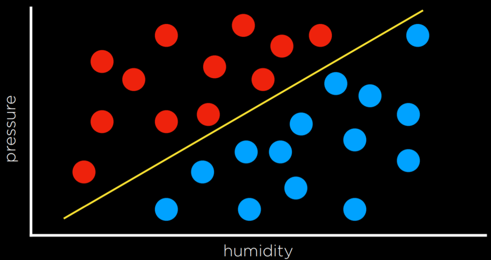

The **drawback** to this approach is that data are messy, and it is rare that one can draw a line and neatly divide the classes into two observations without any mistakes.

Often, we will compromise, drawing a boundary that separates the observations correctly more often than not, but **still occasionally misclassifies** them.

In this case, the input of
- x₁ = Humidity
- x₂ = Pressure

will be given to a **hypothesis** function h(x₁, x₂), which will output its prediction of whether it is going to rain that day or not. It will do so by checking on which side of the decision boundary the observation falls.

Formally, the function will **weight each of the inputs** with **an addition of a constant**, ending in a linear equation of the following form:
- Rain w₀ + w₁x₁ + w₂x₂ ≥ 0
- No Rain otherwise

Often, the output variable will be coded as 1 and 0, where if the equation yields **more than 0, the output is 1 (Rain)**, and **0 otherwise (No Rain)**.

getting to the best weight vector is the **goal** of the machine learning algorithm

**dot** product of the two vectors dot product of the two vectors
- w: (w₀, w₁, w₂),
- x: (1, x₁, x₂)

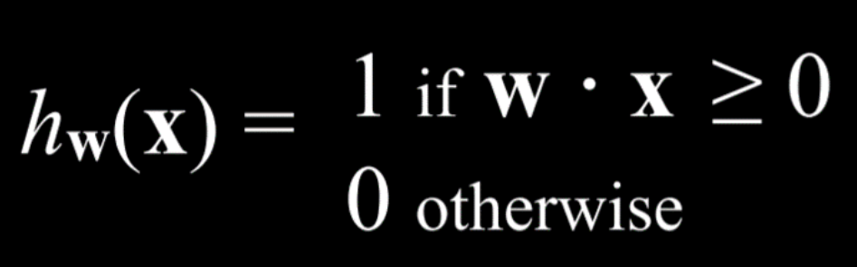

**perceptron learning rule:**

$w_{\mathrm{i+1}}=w_{\mathrm{i}}+\alpha\left(\mathrm{y}-h_{\mathrm{w}}(\mathbf{x})\right) \times x_{\mathrm{i}}$

for each data point, we **adjust the weights to make our function more accurate**.

note: 

- y stands for the observed value
- the hypothesis function stands for the estimate.
- The higher α, the stronger the influence each new event has on the weight.

If they are identical, this whole term is equal to zero, and thus the weight is not changed.

If we **underestimated** (calling No Rain while Rain was observed), then the value in the parentheses will be 1 and the weight will increase by the value of xᵢ scaled by α the learning coefficient.

If we **overestimated** (calling Rain while No Rain was observed), then the value in the parentheses will be -1 and the weight will decrease by the value of x scaled by α.

**hard threshold:**

The result of this process is a threshold function that switches from 0 to 1 once the estimated value **crosses some threshold.** (here the threshold is 0)

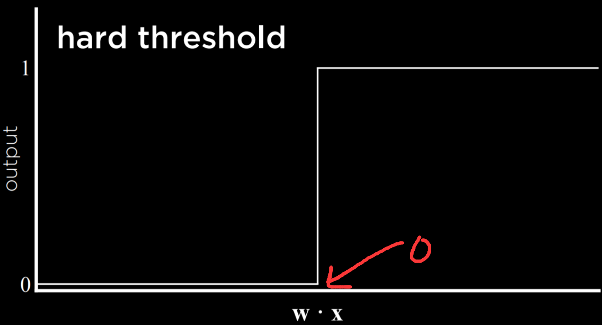

The problem with this type of function is that it is **unable to express uncertainty**, since it can only be equal to 0 or to 1.

**soft threshold:**

A way to go around this is by using a logistic function, which employs a soft threshold.

**A logistic function** can yield a real number between 0 and 1, which will **express confidence in the estimate**.

**The closer the value to 1, the more likely it is to rain.**

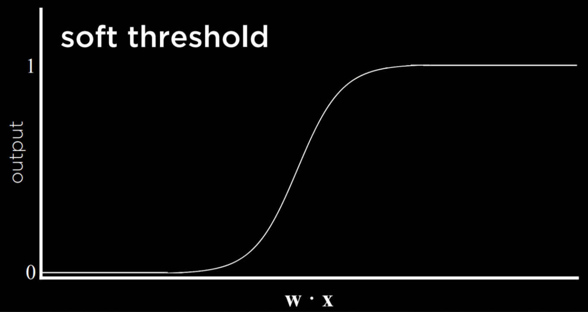

##### 4.1.1.1.3 Support Vector Machines

In addition to nearest-neighbor and linear regression, another approach to classification is the Support Vector Machine. 

This approach uses **an additional vector (support vector)** near the decision boundary to make the best decision when separating the data. Consider the example below.

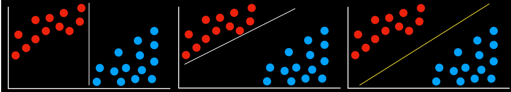

**pros:**

1. keeps the **most distance** from each of the groups

    All the decision boundaries work in that they separate the data without any mistakes.

    However, are they equally as good? The two leftmost decision boundaries are very close to some of the observations. This means that a new data point that **differs only slightly from one group can be wrongly classified as the other**.

    As opposed to that, the rightmost decision boundary keeps the most distance from each of the groups, thus giving the most leeway for variation within it.

    This type of boundary, which is as far as possible from the two groups it separates, is called the **Maximum Margin Separator.**

2. represent decision boundaries with **more than two dimensions**, as well as **non-linear decision boundaries**

    Another benefit of support vector machines is that they can represent decision boundaries with more than two dimensions, as well as non-linear decision boundaries, such as below.
    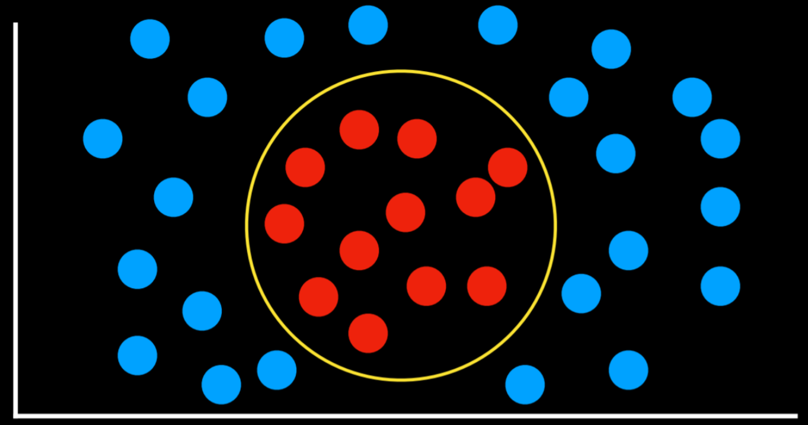

##### 4.1.1.1.4 summary

To summarize, there are **multiple ways to go about classification problems**, with **no one being always better than the other**.

Each has their drawbacks and might prove more useful than others in **specific situations.**

#### 4.1.1.2 Regression

Regression is a **supervised learning** task of a function that **maps an input point to a continuous value, some real number.**

This differs from classification in that classification problems **map an input to discrete values** (Rain or No Rain).

For example, a company might use regression to answer the question of how money spent advertising predicts money earned in sales.
In this case, an **observed function f(advertising)** represents the observed income following some money that was spent in advertising (note that the function can take more than one input variable). These are the data that we start with. With this data, we want to come up with **a hypothesis function h(advertising)** that will try to **approximate the behavior** of function f.

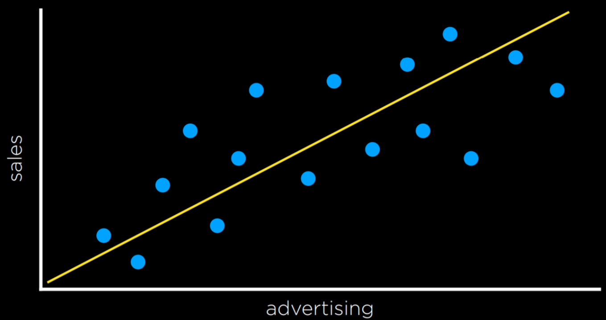

### 4.1.2 Loss Functions

Loss functions are a way to quantify the utility lost by any of the decision rules above.

**The less accurate the prediction, the larger the loss.**

**For classification problems**, we can use a 0-1 Loss Function.

L(actual, predicted):
- 0 if actual = predicted
- 1 otherwise

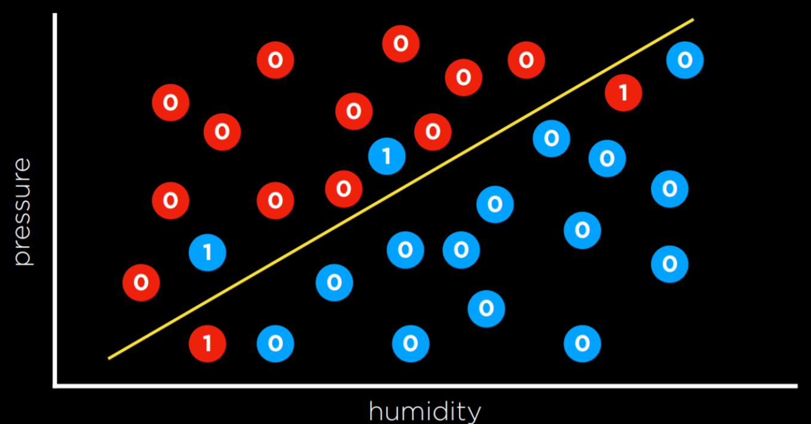
In the example above, the days that are valued at 0 are the ones where we predicted the weather correctly (rainy days are below the line and not rainy days are above the line). However, days when it didn’t rain below the line and days when it did rain above it are the ones that we failed to predict. We give each one the value of 1 and sum them up to **get an empirical estimate** of how lossy our decision boundary is.

**For predicting a continuous value.**

L₁ and L₂ loss functions can be used when predicting a continuous value. In this case, we are interested in quantifying for each prediction how much it differed from the observed value. We do this by taking either the absolute value or the squared value of the observed value minus the predicted value (i.e. how far the prediction was from the observed value).

- L₁: $L(actual, predicted) = |actual - predicted|$
- L₂: $L(actual, predicted) = (actual - predicted)²$

L₂ penalizes outliers **more harshly** than L₁ because it squares the the difference.
 
L₁ can be visualized by summing the distances from each observed point to the predicted point on the regression line:

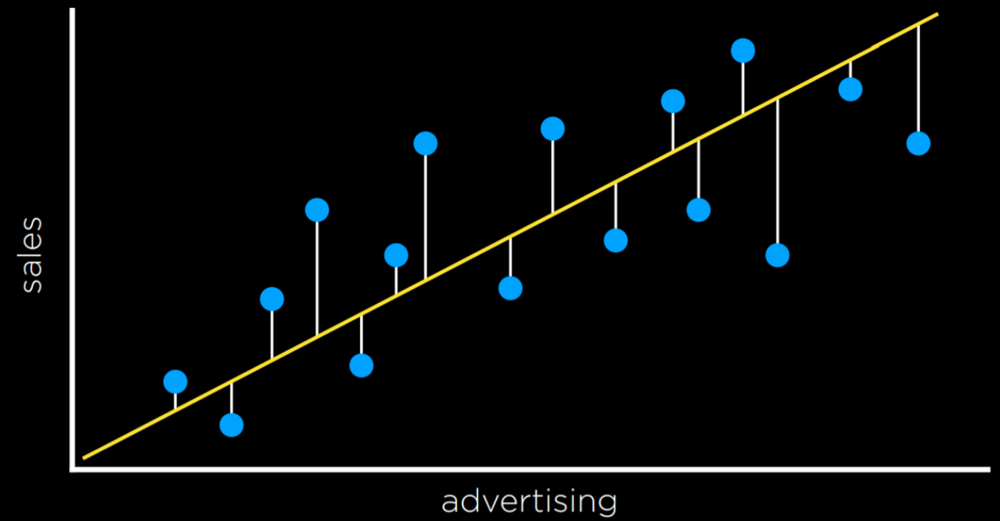

### 4.1.3 Overfitting

Overfitting is when a model fits the training data so well that it fails to generalize to other data sets.

In this sense, **loss functions are a double edged sword**. In the two examples below, the loss function is minimized such that the loss is equal to 0. However, it is unlikely that it will fit new data well.

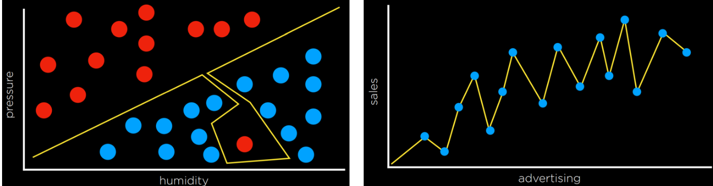

For example, in the left graph, a dot next to the red one at the bottom of the screen is likely to be Rain (blue). However, with the overfitted model, it will be classified as No Rain (red).

### 4.1.4 Regularization

Regularization is the process of penalizing hypotheses that are more complex to favor simpler, more general hypotheses. **We use regularization to avoid overfitting.**

In regularization, we estimate the **cost** of the hypothesis function h by adding up **its loss** and a measure of **its complexity.**

$cost(h) = loss(h) + λcomplexity(h)$

Lambda (λ) is a constant that we can use to modulate how strongly to penalize for complexity in our cost function. The higher λ is, the more costly complexity is.

One way to test whether we overfitted the model is with **Holdout Cross Validation**.

In this technique, **we split all the data in two**: **a training set and a test set**. We run the learning algorithm on the training set, and then see how well it predicts the data in the test set.

The idea here is that by testing on data that were not used in training, we can a **measure how well the learning generalizes.**

The **downside** of holdout cross validation is that we don’t get to train the model on half the data (the half data for testing), since it is used for evaluation purposes.

A way to deal with this is using **k-Fold Cross-Validation**. In this process, we divide the data into k sets. **We run the training k times, each time leaving out one dataset and using it as a test set.** We end up with k different evaluations of our model, which we can **average** and get an estimate of how our model generalizes **without losing any data.**

### 4.1.5 scikit-learn

### 4.1.6 Reinforcement Learning

Reinforcement learning is **another approach to machine learning**, where after each action, the agent gets feedback in the form of reward or punishment (a positive or a negative numerical value).

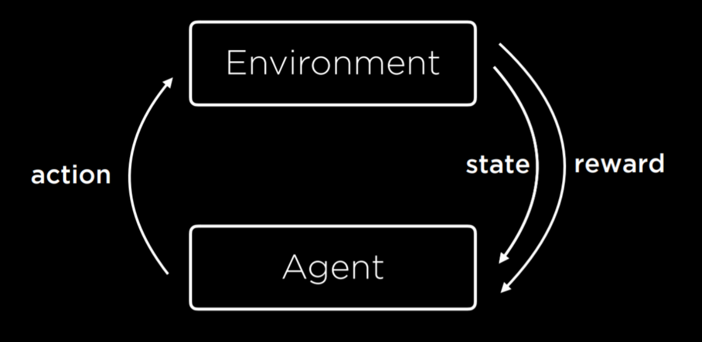

The learning process 
1. starts by the environment providing a state to the agent.
2. Then, the agent performs an action on the state.
3. Based on this action, the environment will return **a state (new)** and a reward to the agent,
    
    where the reward can be positive, making the behavior more likely in the future, or negative (i.e. punishment), making the behavior less likely in the future.

This type of algorithm can be used to train walking robots, for example, where each **step** returns a positive number (reward) and each **fall** a negative number (punishment).

#### 4.1.6.1 Markov Decision Processes

Reinforcement learning can be viewed as a **Markov decision process**, having the following properties:

- Set of states S
- Set of actions Actions(S)
- Transition model P(s’ | s, a)
- Reward function R(s, a, s’)

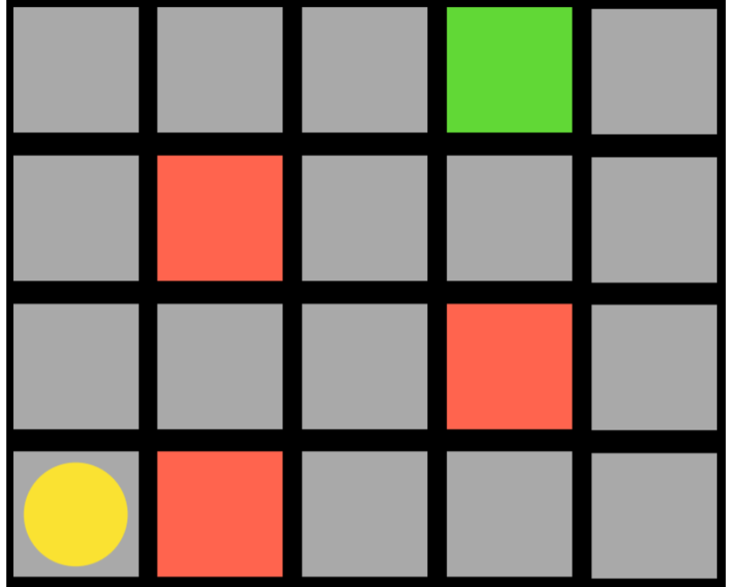

The agent is the yellow circle, and it needs to get to the green square while avoiding the red squares.

- Every single square in the task is a state.
- Moving up, down, or to the sides is an action.
- The transition model gives us the new state after performing an action
- and the reward function is what kind of feedback the agent gets.

For example, if the agent chooses to go right, it will step on a red square and get negative feedback.

This means that the agent will learn that, when in the state of being in the bottom-left square, it should avoid going right.

This way, the agent will start exploring the space, **learning which state-action pairs it should avoid**.

The algorithm can be **probabilistic**, choosing to take different actions in different states **based on some probability that’s being increased or decreased based on reward**.

When the agent reaches the green square, it will get a positive reward, learning that it is favorable to take the action it took in the previous state.

#### 4.1.6.2 Q-Learning

1. how to update the Q(s, a)
2. how to make decision on curr state s.

##### 4.1.6.2.1 update Q(s, a)

Q-Learning is **one model of reinforcement learning**, where a function Q(s, a) outputs an estimate of the value of taking action a in state s.

1. The model starts with all estimated values equal to 0 (Q(s,a) = 0 for all s, a)
2. When an action is taken and a reward is received, the function does two things:

    1. it **newly** estimates the value of Q(s, a) based on **current reward and expected future rewards**
    2. updates Q(s, a) to take into account **both the old estimate and the new estimate.**

**rule:**

$Q(s, a)_{i+1} ⟵ Q(s, a)_{i} + α(new value estimate - Q(s, a)_{i})$

The updated value of Q(s, a) is equal to the previous value of Q(s, a) in addition to some updating value.

This value is determined as the difference between the new value and the old value, multiplied by α, a **learning coefficient**.
- When α = 1 the new estimate simply overwrites the old one.
- When α = 0, the estimated value is never updated.
- By raising and lowering α, we can determine **how fast previous knowledge is being updated by new estimates.**

The new value estimate can be expressed as **a sum of the reward (r) and the future reward estimate**.

To get the future reward estimate, we consider the new state that we got after taking the last action, and add the estimate of the action in this new state that will bring to the **highest reward**.

This way, we estimate the utility of making action a in state s **not only by the reward it received, but also by the expected utility of the next step.**

The value of the future reward estimate can sometimes appear with **a coefficient gamma** that controls how much future rewards are valued. We end up with the following equation:

$Q(s, a)_{i+1} \leftarrow \mathrm{Q}(s, a)_{i}+\alpha\left(\left(\mathrm{r}+\gamma \max _{a^{\prime}} \mathrm{Q}\left(\mathrm{s}^{\prime}, \mathrm{a}^{\prime}\right)\right)-\mathrm{Q}(s, a)_{i}\right)$

##### 4.1.6.2.2 how to make decision

A **Greedy Decision-Making** algorithm completely discounts the future estimated rewards, instead **always choosing the action a in current state s that has the highest Q(s, a).**

This brings us to discuss the **Explore vs. Exploit tradeoff**.

- A greedy algorithm always exploits, taking the actions that are already established to bring to good outcomes. However, **it will always follow the same path to the solution**, never finding a better path.
- Exploration, on the other hand, means that the algorithm **may** use a previously unexplored route on its way to the target, allowing it to **discover more efficient solutions** along the way.

**ε (epsilon) greedy algorithm:**

To implement the concept of exploration and exploitation, we can use the ε (epsilon) greedy algorithm.

In this type of algorithm, we set ε equal to how often we want to move randomly. 
- With probability 1-ε, the algorithm chooses the best move (exploitation).
- With probability ε, the algorithm chooses a random move (exploration).

##### 4.1.6.2.3 Another way to train

Another way to train a reinforcement learning model is to give feedback **not upon every move**, but **upon the end of the whole process.**

For example, consider a game of **Nim**. In this game, different numbers of objects are distributed between piles. Each player takes any number of objects from any one single pile, and the player **who takes the last object looses.**

In such a game, an untrained AI will play randomly, and it will be easy to win against it.

To train the AI, it will start from playing a game randomly, and in the end **get a reward of 1 for winning and -1 for losing**.

When it is trained on 10,000 games, for example, it is already **smart enough to be hard to win against it.**

##### 4.1.6.2.4 cons

This approach becomes more computationally demanding when a game has multiple states and possible actions, such as chess.

It is infeasible to generate an estimated value for every possible move in every possible state.

In this case, we can use a **function approximation**, which allows us to approximate Q(s, a) using various other features, **rather than storing one value for each state-action pair**.

Thus, the algorithm becomes able to recognize **which moves are similar** enough **so that their estimated value should be similar as well**, and use this heuristic in its decision making.

### 4.1.3 Unsupervised Learning

**Clustering:**
Clustering is an unsupervised learning task that takes the input data and organizes it into groups such that similar objects end up in the same group. 

This can be used, for example, in **genetics research**, when trying to find similar genes, or in **image segmentation**, when defining different parts of the image based on similarity between pixels.

#### 4.1.3.1 k-means Clustering

1. It maps all data points in a space, and then **randomly** places k **cluster centers** in the space (it is up to the programmer to decide how many; this is the starting state we see on the left).Each cluster center is simply a point in the space.

2. Then, each cluster gets assigned all the points that are closest to its center than to any other center (this is the middle picture).

3. Then, in an iterative process, the cluster center **moves to the middle of all these points** (the state on the right),
4.  and then points are reassigned again to the clusters whose centers are now closest to them.

5. When, after repeating the process, **each point remains in the same cluster it was before**, we have reached an equilibrium and the algorithm is over, leaving us with points divided between clusters.

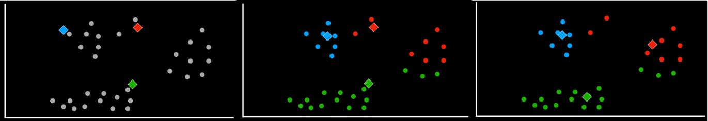