# 5.Neural Networks

AI neural networks are inspired by neuroscience.

In the brain, neurons are cells that are connected to each other, forming networks.

Each neuron is capable of both receiving and sending electrical signals. Once the electrical input that a neuron receives **crosses some threshold**, the neuron activates, thus sending its electrical signal forward.

An **Artificial Neural Network** is a mathematical model for learning inspired by biological neural networks. Artificial neural networks model mathematical functions that **map inputs to outputs** based on the **structure** and **parameters** of the network.

In artificial neural networks, the **structure** of the network is shaped through training on data.

When implemented in AI, **the parallel of each neuron is a unit** that’s connected to other units.

For example, like in the last lecture, the AI might map two inputs, x₁ and x₂, to whether it is going to rain today or not.

Last lecture, we suggested the following form for this hypothesis function: h(x₁, x₂) = w₀ + w₁x₁ + w₂x₂, where w₁ and w₂ are weights that modify the inputs, and w₀ is a constant, also called **bias**, modifying the value of the whole expression.

## 5.1 Activation Functions

To use the hypothesis function to decide whether it rains or not, we need to create some sort of **threshold** based on the value it produces.

**three activation functions:**

- One way to do this is **with a step function**, which gives 0 before a certain threshold is reached and 1 after the threshold is reached. **(hard threshold)**

  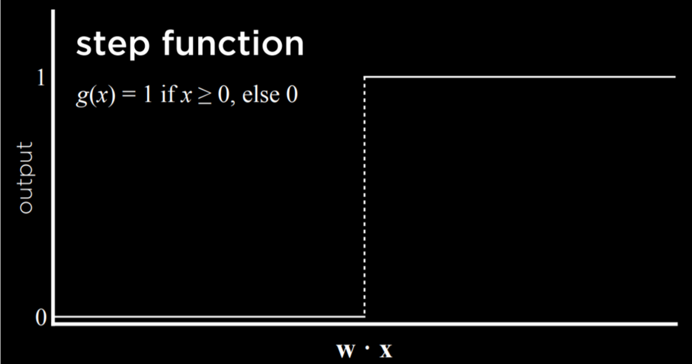
- Another way to go about this is **with a logistic function**, which gives as output any real number from 0 to 1, thus expressing graded **confidence** in its judgment. **(soft threshold)**

  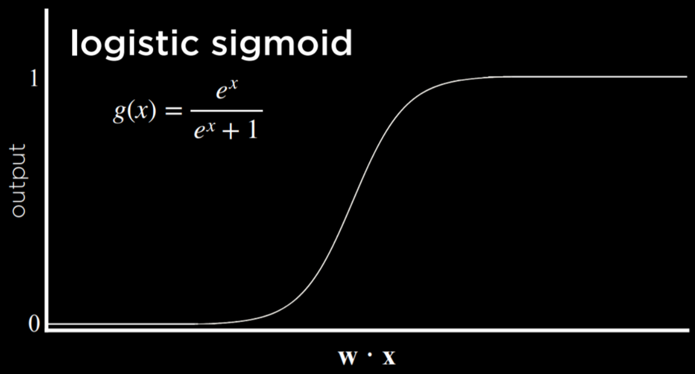
- Another possible function is **Rectified Linear Unit (ReLU)**, which allows the output to be any positive value. If the value is negative, ReLU sets it to 0.

  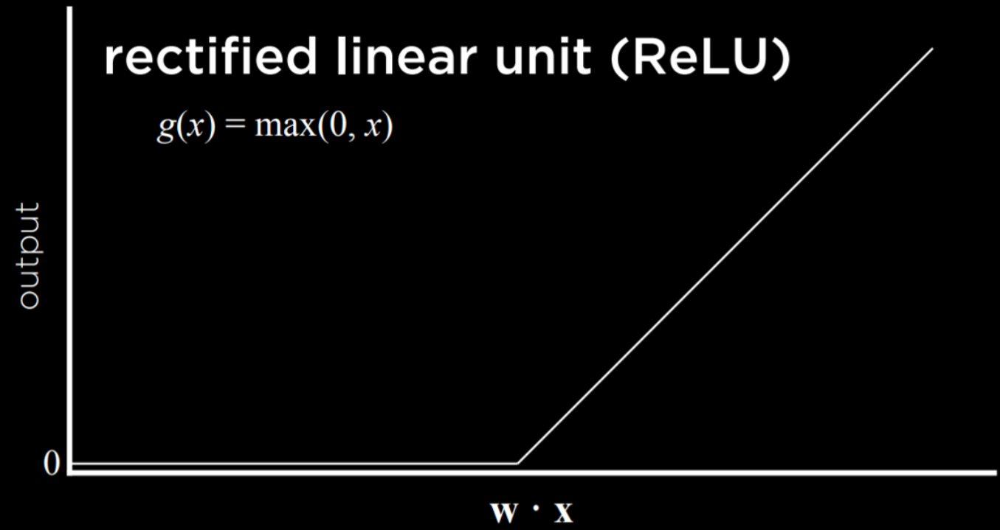

Whichever function we choose to use, we learned last lecture that **the inputs are modified by weights in addition to the bias**, and the sum of those is passed to **an activation function**. This stays true for **simple neural networks**.

## 5.2 Neural Network Structure

Whichever function we choose to use, we learned last lecture that **the inputs are modified by weights in addition to the bias**, and the sum of those is passed to **an activation function**. This stays true for **simple neural networks**.

A neural network can be thought of **as a representation of the idea above**, where a function sums up inputs to produce an output.

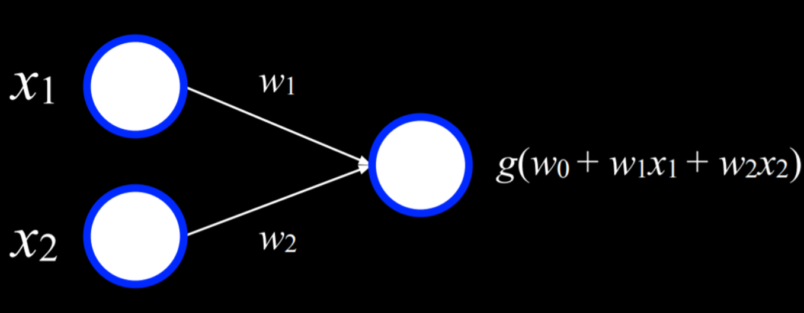

- The two white units on the left are the **input**
- the unit on the right is an **output**.
- The inputs are connected to the output by a **weighted edge**.
- To make a decision, the output unit multiplies the inputs by their weights in addition to the **bias** (w₀), and the **uses activation function g** to determine the output.

e.g.

| *x* | *y* | *f(x, y)* |
| ----- | ----- | ----------- |
| 0     | 0     | 0           |
| 0     | 1     | 1           |
| 1     | 0     | 1           |
| 1     | 1     | 1           |

For example, an Or logical connective can be represented as a function f with the following truth table:

We can visualize this function as a neural network. x₁ is one input unit, and x₂ is another input unit. They are connected to the output unit by an edge with a weight of 1. The output unit then **uses activation function** g(**-1** + 1x₁ + 2x₂) with a threshold of 0 to output either 0 or 1 (false or true).

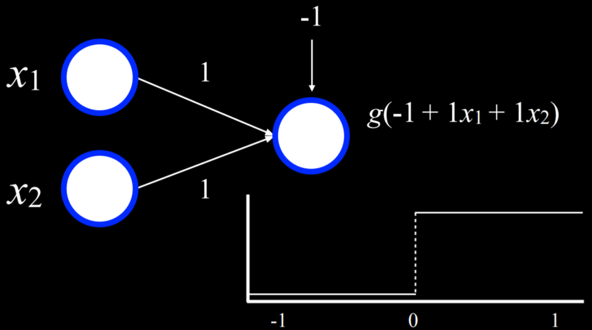

For example, in the case where x₁ = x₂ = 0, the sum is (-1). This is below the threshold, so the function g will output 0. However, if either or both of x₁ or x₂ are equal to 1, then the sum of all inputs will be either 0 or 1. Both are at or above the threshold, so the function will output 1.

A similar process can be repeated with the And function (**where the bias will be (-2)**).

Moreover, inputs and outputs don’t have to be distinct.

A similar process can be used to take humidity and air pressure as input, and produce the probability of rain as output.

Or, in a different example, inputs can be money spent on advertising and the month when it was spent to get the output of expected revenue from sales.

**This can be extended to any number of inputs by multiplying each input x₁ … xₙ by weight w₁ … wₙ, summing up the resulting values and adding a bias w₀.**

## 5.3 Gradient Descent

Gradient descent is an algorithm for **minimizing loss when training neural networks.**

**loss function: (all points)**

$f(\boldsymbol{w}) = \Sigma_{i} (\boldsymbol{w} * \boldsymbol{x}_{i} - y)^{2} = \Sigma_{i} ({(\Sigma_{j}w_{j}x_{ij}) - y} )^{2}$

$f(\boldsymbol{w}+\Delta \boldsymbol{w}) \simeq f(\boldsymbol{w})+\Delta \boldsymbol{w}^{\mathrm{T}} \nabla f(\boldsymbol{w}),$


$\nabla f(\boldsymbol{w}) = 
\begin{bmatrix}
2\Sigma_{i} x_{i1} \\
2\Sigma_{i} x_{i2} \\
2\Sigma_{i} x_{i3} \\
2\Sigma_{i} x_{i4} \\
2\Sigma_{i} x_{i5} \\
...
\end{bmatrix}$

$\Delta\boldsymbol{w} = -\lambda \nabla f(\boldsymbol{w}) = \begin{bmatrix}
2\lambda\Sigma_{i} x_{i1} \\
2\lambda\Sigma_{i} x_{i2} \\
2\lambda\Sigma_{i} x_{i3} \\
2\lambda\Sigma_{i} x_{i4} \\
2\lambda\Sigma_{i} x_{i5} \\
...
\end{bmatrix}$

**get weghts:**

As was mentioned earlier, a neural network is capable of inferring knowledge about **the structure of the network itself (param, that is weights here)** from the data. Whereas, so far, we defined the different weights, neural networks allow us to **compute these weights** based on the training data.

To do this, we use the gradient descent algorithm, which works the following way:

- Start with **a random choice of weights**. This is our naive starting place, where we don’t know how much we should weight each input.
- Repeat:
    - **Calculate the gradient** based on all data points that will lead to decreasing loss. Ultimately, the **gradient is a vector** (a sequence of numbers).
    - **Update weights** according to the gradient.

**cons:**

The problem with this kind of algorithm is that it requires to **calculate the gradient based on all data points**, which is **computationally costly**.

There are a multiple ways to minimize this cost. 

- For example, in **Stochastic Gradient Descent**, the gradient is calculated based on **one point** chosen at random. This kind of gradient can be quite inaccurate, 
- leading to the **Mini-Batch Gradient Descent algorithm**, which computes the gradient based on on **a few points** selected at random, thus finding a compromise between computation cost and accuracy.

As often is the case, **none of these solutions is perfect**, and **different solutions might be employed in different situations.**


Using gradient descent, it is possible to find answers to many problems.

For example, we might want to know more than “will it rain today?”
- We can use some inputs to generate probabilities for **different kinds of weather**, each output node's value is the **activation function output.**
- and then just choose the weather that **is most probable.**

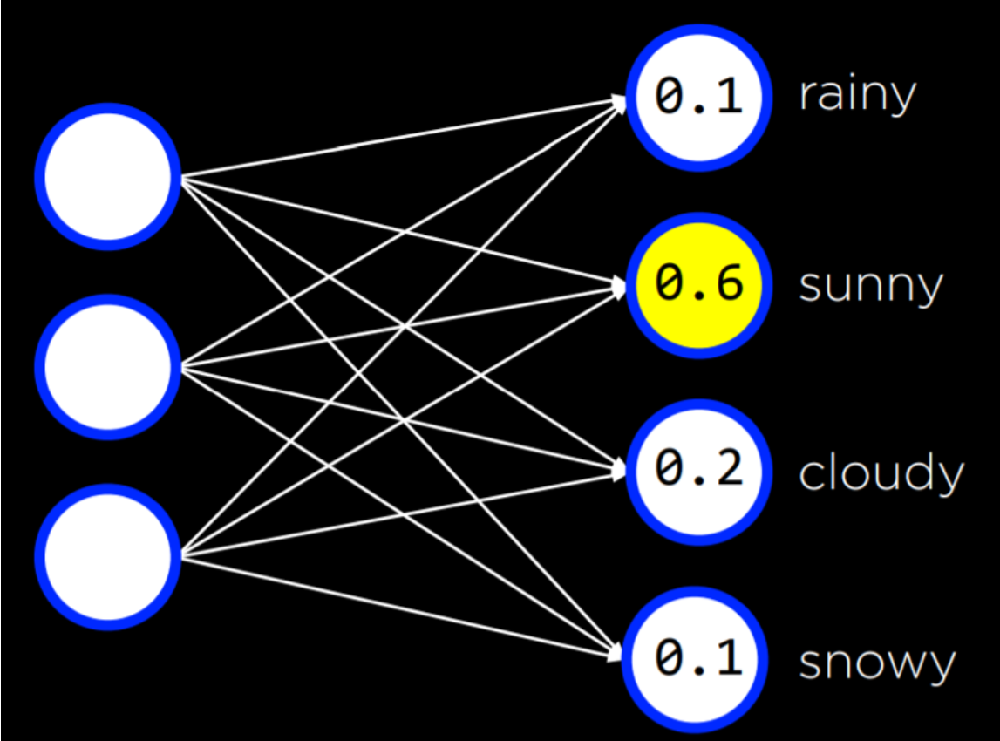

This can be done with any number of inputs and outputs, where each input is connected to each output, and where the outputs represent decisions that we can make.

Note that in this kind of neural networks the **outputs are not connected**. This means that each output and its associated weights from all the inputs can be be seen as **an individual neural network** and thus** can be trained separately** from the rest of the outputs.


So far, our neural networks relied on **perceptron** output units. These are units that are only capable of learning **a linear decision boundary**, using a straight line to separate data.

That is, based on a linear equation, the perceptron could classify an input to be one type or another (e.g. left picture). However, often, data are not linearly separable (e.g. right picture).

In this case, we turn to multilayer neural networks to **model data non-linearly.**
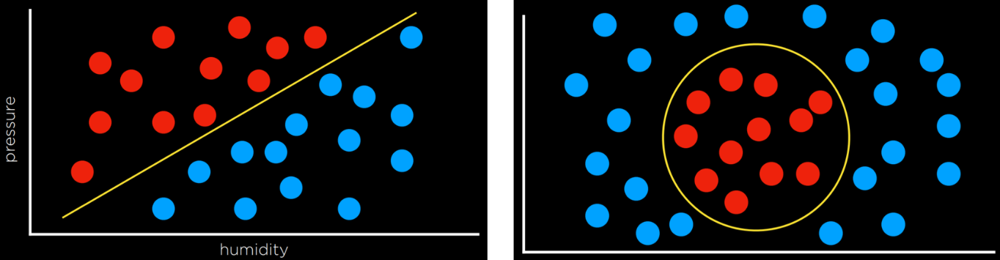

## 5.4 Multilayer Neural Networks

A multilayer neural network is an artificial neural network with 
- an input layer, 
- an output layer, 
- **at least one hidden layer.**


While we provide inputs and outputs to train the model, we, the humans, **don’t provide any values to the units inside the hidden layers**.

Each unit in the first hidden layer receives a weighted value from each of the units in the input layer, **performs some action on it** and outputs a value. 

Each of these values is weighted and further propagated to the next layer, repeating the process until the output layer is reached.

Through hidden layers, it is possible to model non-linear data.

e.g.

weight1( action(weight2(data)) + action(weight3(data)) )

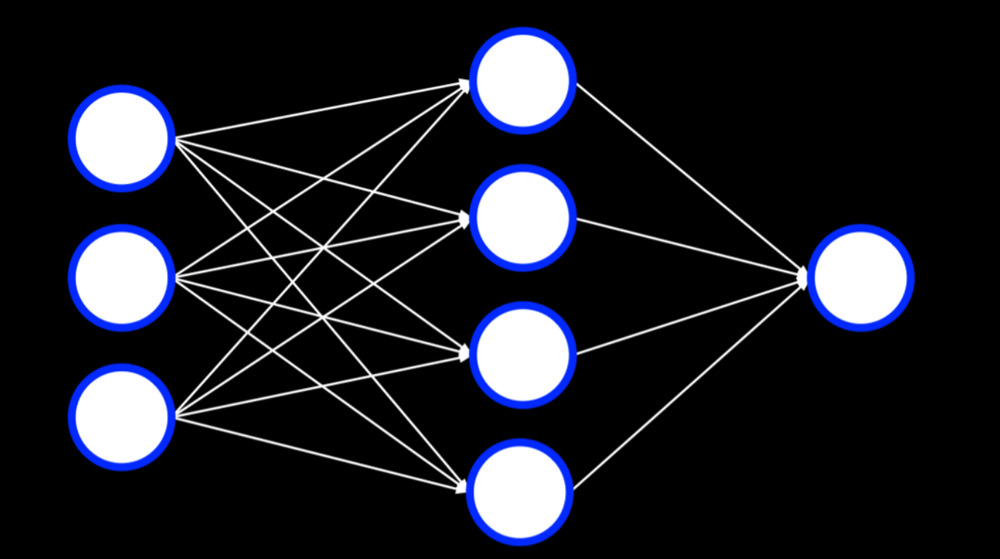

## 5.5 Backpropagation

`TODO`

Backpropagation is the main algorithm used for **training neural networks with hidden layers**.

It does so by starting with the **errors** in the output units, calculating the **gradient descent for the weights of the previous layer**, and repeating the process until the input layer is reached.

In pseudocode, we can describe the algorithm as follows:

- Calculate error for output layer
- For each layer, starting with output layer and moving inwards towards earliest hidden layer:
    - Propagate error back one layer. In other words, the current layer that’s being considered sends the errors to the preceding layer.
    - Update weights.

This can be extended to **any number of hidden layers**, creating **deep neural networks**, which are neural networks that have **more than one hidden layer**.

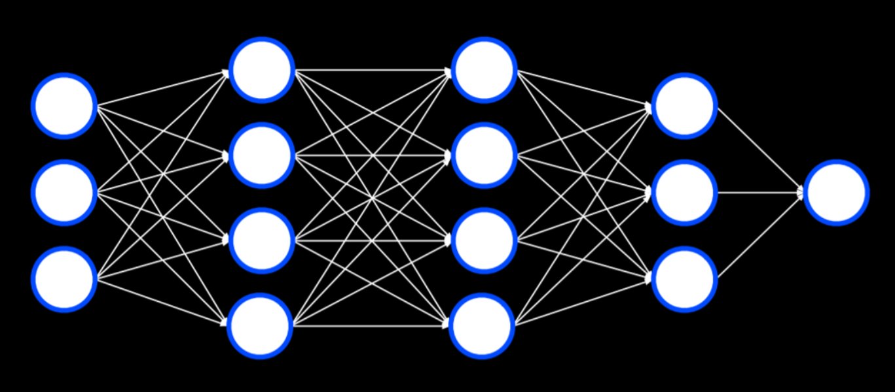

## 5.6 Overfitting

One way to combat overfitting is by **dropout**.

remove some **args (that is edge here, unit)**.

In this technique, we **temporarily** remove units that we select at **random** during the learning phase.

This way, we try to prevent **over-reliance** on any one unit in the network.

Throughout training, the neural network will assume different forms, each time dropping some other units and then using them again:

**guess:**

- last iteration need to train the whole unit again.

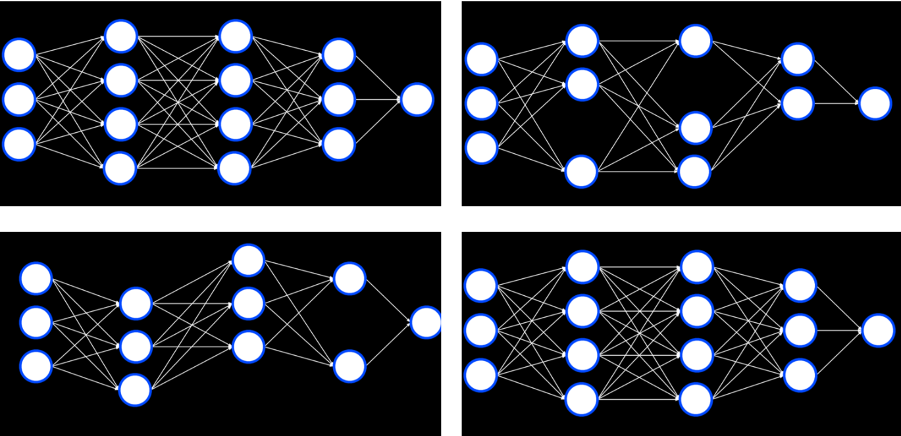

Note that after the training is finished, **the whole neural network will be used again**.

## 5.7 TensorFlow

Like often is the case in python, multiple libraries already have an implementation for neural networks **using the backpropagation algorithm**, and TensorFlow is one such library. 

e.g.

distinguishing counterfeit notes from genuine notes.

Our work is often required in **making the data fit the format** that the library requires.
```py
# Create a neural network
model = tf.keras.models.Sequential()

```
- Keras is an api that different machine learning algorithms access.
- A **sequential** model is one where layers follow each other (like the ones we have seen so far).


```py
# Add a hidden layer with 8 units, with ReLU activation
model.add(tf.keras.layers.Dense(8, input_shape=(4,), activation="relu"))
```
A **dense** layer is one where each node in the current layer is connected to all the nodes from the previous layer.

In generating our hidden layers we create 8 (mean the layer has 8 unit, not 8 layers) dense layers, each having 4 input neurons, using the ReLU activation function mentioned above.

```py
# Add output layer with 1 unit, with sigmoid activation
model.add(tf.keras.layers.Dense(1, activation="sigmoid"))
```
In our output layer, we want to create one dense layer that uses a sigmoid activation function, an activation function where the output is a value between 0 and 1.

```py
# Train neural network
model.compile(
    optimizer="adam",
    loss="binary_crossentropy",
    metrics=["accuracy"]
)
model.fit(X_training, y_training, epochs=20)

# Evaluate how well model performs

model.evaluate(X_testing, y_testing, verbose=2)
```
Finally, we compile the model, specifying which algorithm should **optimize** it, what type of loss function we use, and how we want to measure its success (in our case, we are interested in the **accuracy** of the output).
 
Finally, we fit the model on the training data with 20 **repetitions** (epochs), and then evaluate it on the testing data.

## 5.8 Computer Vision

Computer vision encompasses the different computational methods for analyzing and understanding **digital images**, and it is often achieved **using neural networks.**

For example, computer vision is used when social media employs **face recognition** to automatically tag people in pictures. Other examples are **handwriting recognition** and **self-driving cars**.

Images consist of pixels, and pixels are represented by three values that range from 0 to 255, one for red, one for green and one for blue. These values are often referred to with the acronym RGB.

We can use this to create a neural network where each color value in each pixel is an input, where we have some hidden layers, and the output is some number of units that tell us what it is that was shown in the image.

However, there are a few drawbacks to this approach. 
- First, by breaking down the image into pixels and the values of their colors, we can’t use the **structure of the image** as an aid. That is, as humans, if we see a part of a face we know to expect to see the rest of the face, and this quickens computation. We want to be able to use a similar advantage in our neural networks.
- Second, the sheer number of inputs is very big, which means that we will have to calculate a lot of weights.

## 5.9 Image Convolution

Image convolution is applying a **filter** that adds each pixel value of an image to its neighbors, weighted according to a **kernel matrix**.

Doing so alters the image and can **help the neural network process** it.

Let’s consider the following example:

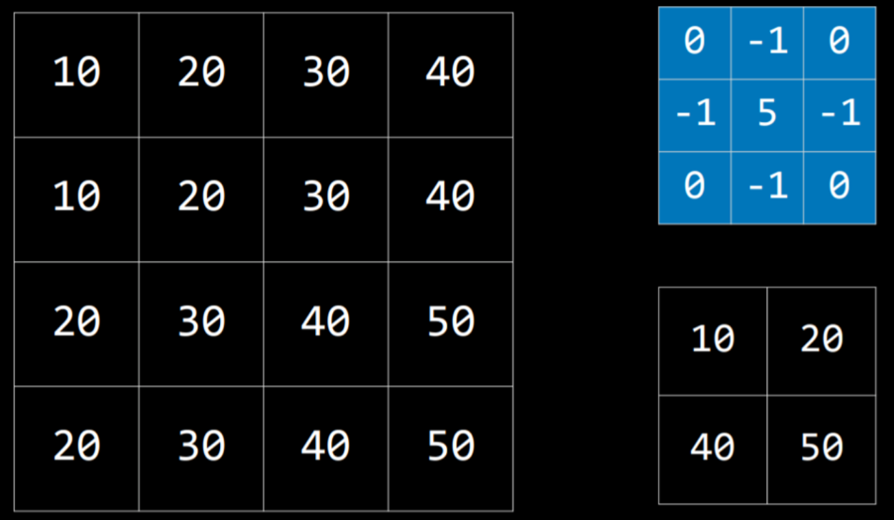

The kernel is the blue matrix, and the image is the big matrix on the left. The resulting filtered image is the small matrix on the bottom right.

To filter the image with the kernel, we start with the pixel with value 20 in the top-left of the image (coordinates 1,1). Then, we will multiply all the values around it by the corresponding value in the kernel and sum them up (10*0 + 20*(-1) + 30*0 + 10*(-1) + 20*5 + 30*(-1) + 20*0 + 30*(-1) + 40*0), producing the value 10. Then we will do the same for the pixel on the right (30), the pixel below the first one (30), and the pixel to the right of this one (40).

This produces a **filtered** image with the values we see on the bottom right.

## 5.10 edge detection

**Different kernels can achieve different tasks.** For **edge detection**, the following kernel is often used:

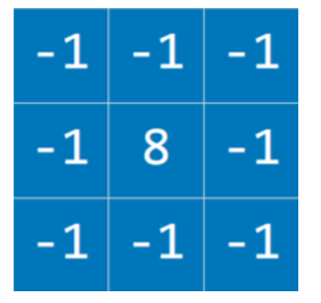

**The idea here is that when the pixel is similar to all its neighbors, they should cancel each other, giving a value of 0.**

Therefore, the more similar the pixels, the darker the part of the image, and the more different they are the lighter it is.

Applying this kernel to an image (left) results in an image with pronounced edges (right):


Still, processing the image in a neural network is **computationally expensive** due to the number of pixels that serve as input to the neural network.

Another way to go about this is **Pooling**, where the size of the input is reduced by **sampling from regions in the input.**

Pixels that are next to each other belong to the same area in the image, which means that they are likely to be **similar**.

Therefore, we can take one pixel to represent a whole area. One way of doing this is with **Max-Pooling**, where the selected pixel is the one with the highest value of all others in the same region. For example, if we divide the left square (below) into four 2X2 squares, by max-pooling from this input, we get the small square on the right.

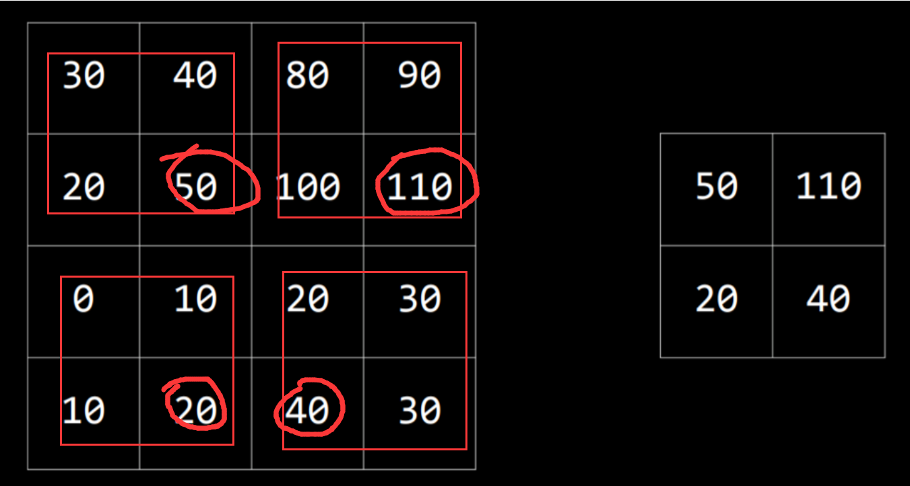

## 5.11 Convolutional Neural Networks

A convolutional neural network is a neural network that uses **convolution**, usually for **analyzing images**.

1. It starts by applying filters that can help distill some features of the image using different kernels.
    These filters can be improved in the same way as other weights in the neural network, by **adjusting their kernels** based on the error of the output. 
    
2. Then, the resulting images are pooled
3. after which the pixels are fed to a traditional neural network as inputs (a process called **flattening**).

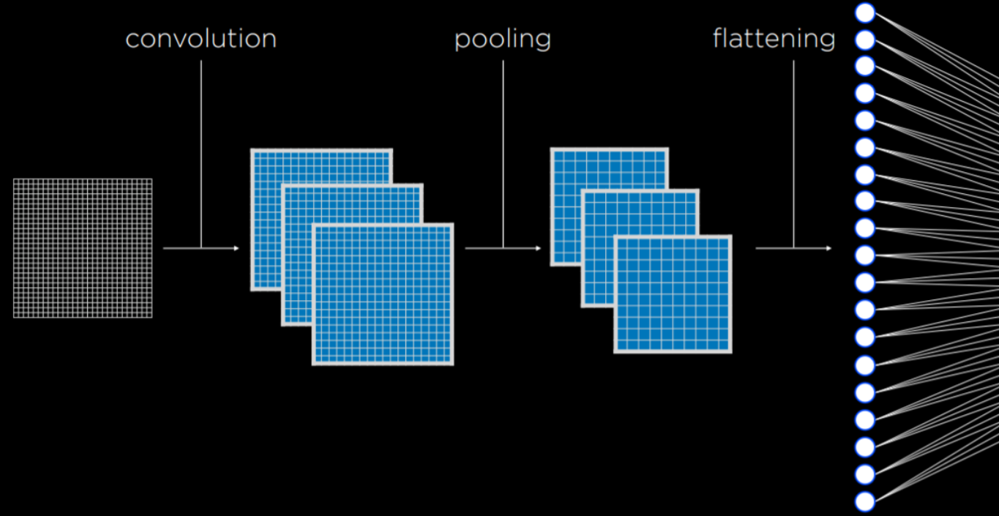

**many benefits:**

The convolution and pooling steps can be repeated multiple times to extract **additional features** and **reduce the size** of the input to the neural network.

One of the benefits of these processes is that, by convoluting and pooling, the neural network becomes **less sensitive to variation**.

That is, if the same picture is taken from slightly different angles, the input for convolutional neural network will be similar, whereas, **without convolution and pooling, the input from each image would be vastly different.**

### 5.11.1 coding

In code, a convolutional neural network doesn’t differ by much from a traditional neural network. 

TensorFlow offers datasets to test our models on.

We will be using MNIST, which contains pictures of black and white handwritten digits. We will train our **convolutional neural network** to **recognize digits**.

Since the model takes time to train, we can **save the already trained model** to use it later.

## 5.12 Recurrent Neural Networks

**Feed-Forward Neural Networks** are the type of neural networks that **we have discussed so far**, where input data is provided to the network, which eventually produces some output.

A diagram of how feed-forward neural networks work can be seen below.

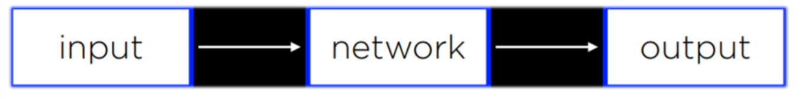

As opposed to that, **Recurrent Neural Networks** consist of a **non-linear** structure, where the network uses **its own output as input**.

For example, Microsoft’s captionbot is capable of describing the content of an image with words in a sentence. This is **different from classification** in that the output can be of **varying length** based on the properties of the image.

While feed-forward neural networks are incapable of **varying the number of outputs**, recurrent neural networks are capable to do that due to their structure.

In the captioning task, a network would process the input to produce an output, and then **continue processing from that point on**, producing another output, and **repeating as much as necessary**.

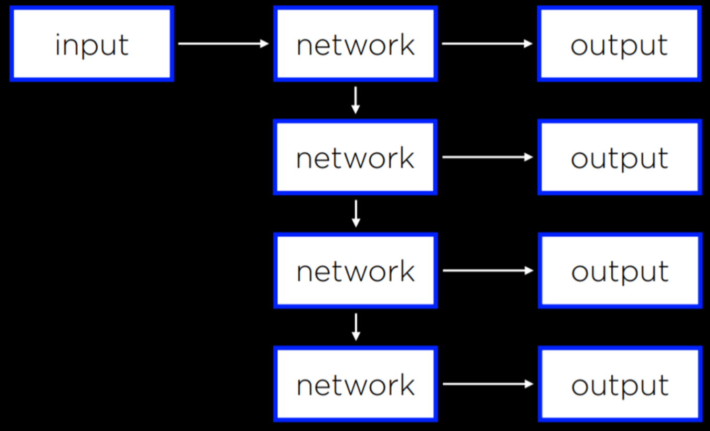

**Recurrent neural networks** are helpful in cases where the network **deals with sequences and not a single individual object.**

- Above, the neural network needed to **produce a sequence of words.** 
- However, the same principle can be applied to analyzing **video files**, which consist of a sequence of images, 
- or in **translation tasks**, where a sequence of inputs (words in the source language) is processed to produce a sequence of outputs (words in the target language).