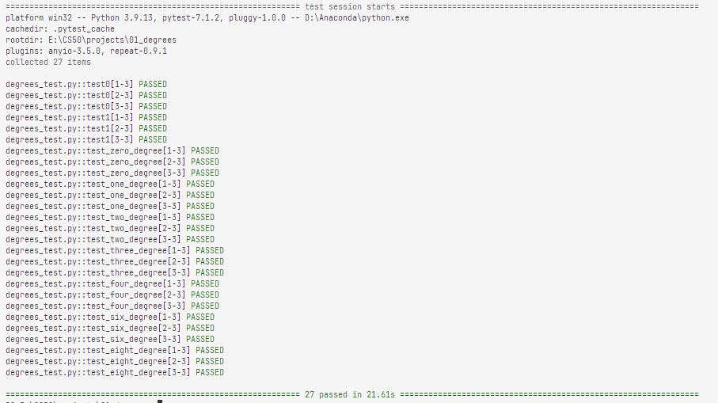

# 01_degrees

knowledge related:
- **[BFS](../notes/lecture0.md/#04-bfs)**

Using the **BFS** method, BFS is always guaranteed to be optimal.

Improv and Fix:

- check whether is target or not, before add node to the frontier
- before add node to the frontier, checking
    
    1. this node is not in the explored for **avoiding the endless loop**
    2. this node is not in the frontier for **avoiding the node.parent and node.action be update causing lenger path.**
- using backtracking for the shortest path
- be careful with `in` and `not in`
- Using `set, dict` other than `list` to **get better perf**

res:

