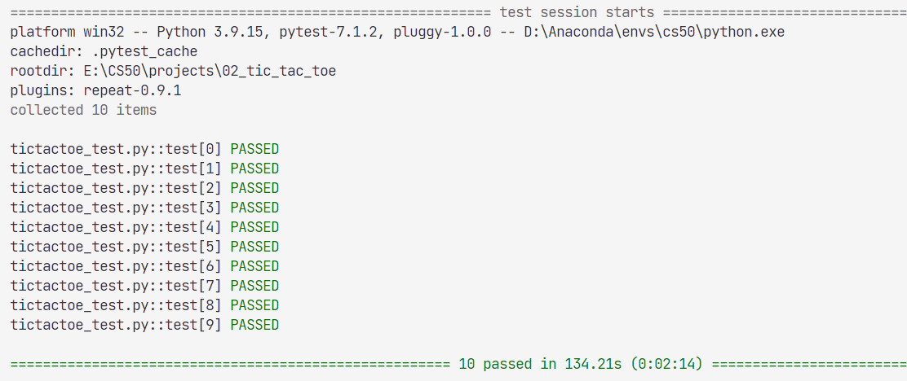
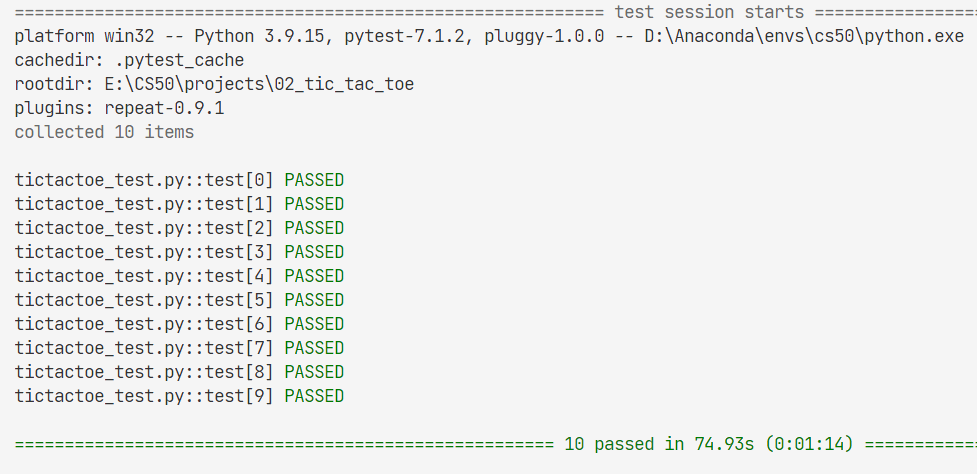

# 02_tic_tac_toe

knowledge related:

- **[Minimax](../notes/lecture0.md/#071-minimax)**
- **[Alpha-Beta Pruning](../notes/lecture0.md/#072-alpha-beta-pruning)**

## 02.1 pkg install

Install pygame: **(Upgrade and just for curr user)**

`python -m pip install -U pygame --user`

test: 

`python -m pygame.examples.aliens`

Uninstall pygame:

`python -m pip uninstall pygame`

ref: [pygame.org](https://www.pygame.org/wiki/GettingStarted)

Or Using `conda` **Recommanded**

1. `conda env create -f .\package-list.yaml`

    Using defaul env name: `cs50`

    **Or**

    `conda env create -f .\package-list.yaml -n <new_env_name>`

    Specific the env name

2. **make sure new env is used**

## 02.2 details

- Using `copy.deepcopy()`

- **Since Tic-Tac-Toe is a tie given optimal play by both sides, you should never be able to beat the AI (though if you don’t play optimally as well, it may beat you!)**

- Alpha-beta pruning is optional, but may make your AI run more efficiently!

res:

res: (**Using Alpha-Beta Pruning**)

