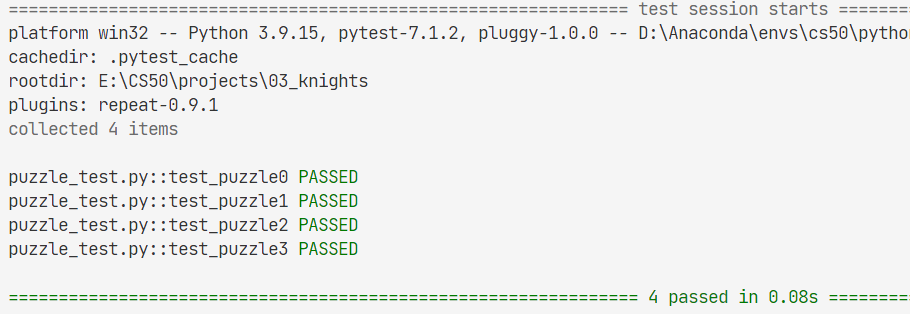

# 03_Knights

knowledge related:
- **propositional logic**
- **model-checking algorithm**

problem:

how to **represent these puzzles using propositional logic**, such that an AI running a **model-checking algorithm** could solve these puzzles for us.

attention:
- printing out **any conclusions** that the model checking algorithm is able to make.
- how to encode information about what the characters actually said.**(biconditional)**

    if the A is knight, then what A said is true,
    else A is not knight, and what A said is false.
- offer **the most direct translation** of the information

    rather than performing logical reasoning on your own
- consider what **the most concise representation** of the information

- **do not miss the easy knowledge e.g. the exclive or(Aknight, Aknave)**

    else, not res, for rules: **under all the models (truth assignments) where the KB is true, R is true as well, then R is res**

res:

