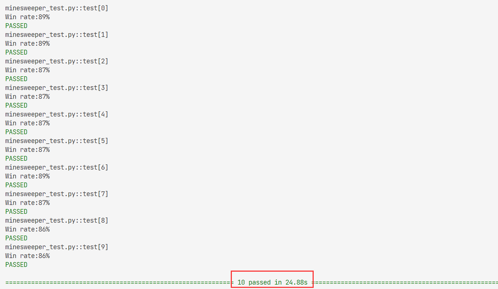

# 04_Minesweeper

knowledge related:
- **[KB inference](../notes//lecture1.md/#13-inference)**
- **[better KB representation](#041-knowledge-representation)**

note:
- **flag a mine** by right-clicking on a cell (or two-finger clicking, depending on the computer).

## 04.1 Knowledge Representation:

if represent knowledge about a Minesweeper game is by **making each cell a propositional variable that is true if the cell contains a mine, and false otherwise.**

then on an 8x8 grid, we’d have **64 variables**, and therefore **2^64 possible models** to check

and the KB is **complicated to expression**.

We need **a better representation of knowledge** for this problem.

before: 

```py
Or(
    And(A, Not(B), Not(C), Not(D), Not(E), Not(F), Not(G), Not(H)),
    And(Not(A), B, Not(C), Not(D), Not(E), Not(F), Not(G), Not(H)),
    And(Not(A), Not(B), C, Not(D), Not(E), Not(F), Not(G), Not(H)),
    And(Not(A), Not(B), Not(C), D, Not(E), Not(F), Not(G), Not(H)),
    And(Not(A), Not(B), Not(C), Not(D), E, Not(F), Not(G), Not(H)),
    And(Not(A), Not(B), Not(C), Not(D), Not(E), F, Not(G), Not(H)),
    And(Not(A), Not(B), Not(C), Not(D), Not(E), Not(F), G, Not(H)),
    And(Not(A), Not(B), Not(C), Not(D), Not(E), Not(F), Not(G), H)
)
```
after: 
```py
{A, B, C, D, E, F, G, H} = 1
```

**rules:**

1. More generally, **any time the number of cells is equal to the count**, we know that all of that sentence’s **cells must be mines**.

2. By extension, **any time we have a sentence whose count is 0**, we know that all of that sentence’s **cells must be safe**.

3. once we know whether a cell is a mine or not, we can **update our sentences to simplify them and potentially draw new conclusions**.
    - C is safe: $\{A, B, C\} = 2 \implies \{A, B\} = 2$
    - C is mine: $\{A, B, C\} = 2 \implies \{A, B\} = 1$

4. any time we have two sentences set1 = count1 and set2 = count2 where **set1 is a subset of set2**, then we can construct the new sentence set2 - set1 = count2 - count1

5. **the cell has been choosen is safe, too**

6. notice the endless loop when getting new sentense

```py
if len(new_knowledge) == 0:
    break
```
7. notice the reentry remove sentense, **Using set other than list** to remove same knowledge

```py
self_knowledge_tmp = set(self.knowledge)
```
8. **the mines should not be in the knowledge set anymore**

```py
neighbor_cells = []
for i in range(cell[0]-1, cell[0]+2):
    for j in range(cell[1]-1, cell[1]+2):
        # simple
        # only include cells whose state is still undetermined in the sentence.
        if (i, j) in self.safes:    # include move has made
            continue
        if (i, j) in self.mines:
            count -= 1
            continue
        if 0 <= i < self.height and 0 <= j < self.width:
            neighbor_cells.append((i, j))
self.knowledge.append(Sentence(neighbor_cells, count))
```

res:


