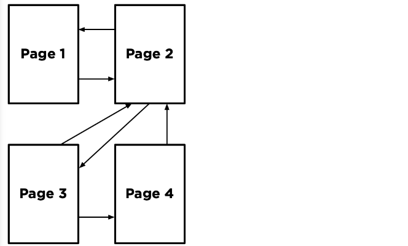
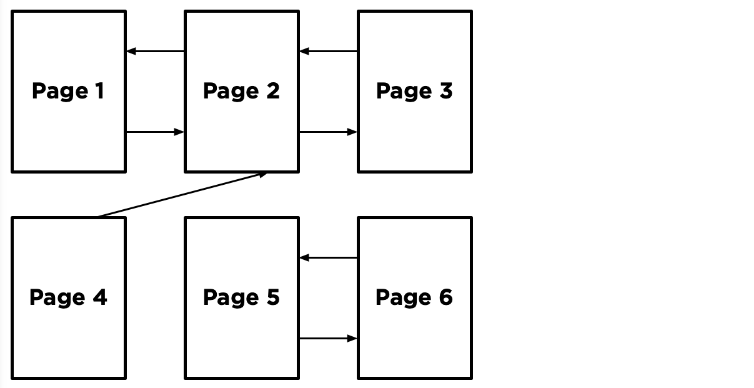
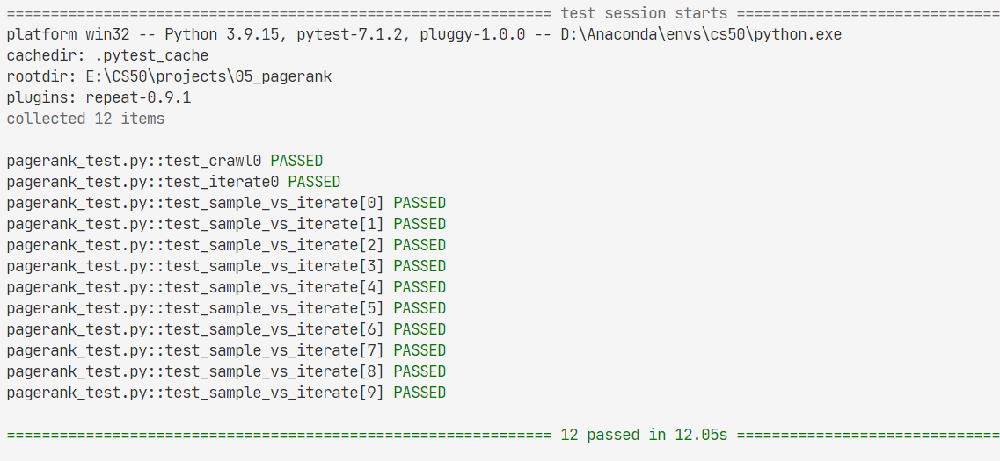

# 05_PageRank

Write an AI to rank web pages by importance.

## 05.1 Background
**Important ?**

One heuristic might be that an “important” page is one that many other pages link to, since it’s reasonable to imagine that more sites will link to a higher-quality webpage than a lower-quality webpage.

We could therefore imagine a system where each page is given a rank according to the number of **incoming links** it has from other pages, and higher ranks would signal higher importance.

But **this definition isn’t perfect**: if someone wants to make their page seem more important, then under this system, they could simply create many other pages that link to their desired page to artificially inflate its rank.

For that reason, the PageRank algorithm was created by Google’s co-founders (including Larry Page, for whom the algorithm was named). In PageRank’s algorithm, a website is more important **if it is linked to by other important websites**, and links from less important websites have their links weighted less. This definition seems a bit circular, but it turns out that there are multiple strategies for calculating these rankings.

### 05.1.1 Random Surfer Model

The random surfer model imagines a surfer who **starts with a web page at random**, and then **randomly chooses links to follow**. If the surfer is on Page 2, for example, they would randomly choose between Page 1 and Page 3 to visit next (**duplicate links** on the same page are treated as a single link, and **links from a page to itself** are **ignored** as well). If they chose Page 3, the surfer would then randomly choose between Page 2 and Page 4 to visit next.

**pros:**

- A page’s **PageRank, then, can be described as the probability** that a random surfer is on that page at any given time. After all, if there are more links to a particular page, then it’s more likely that a random surfer will end up on that page.
- Moreover, a link from a more important site is more likely to be clicked on than a link from a less important site that fewer pages link to, so this model **handles weighting links by their importance as well**.

**cons:**

Imagine we randomly started by sampling Page 5. We’d then have no choice but to go to Page 6, and then no choice but to go to Page 5 after that, and then Page 6 again, and so forth. We’d end up with an estimate of 0.5 for the PageRank for Pages 5 and 6, and an estimate of 0 for the PageRank of all the remaining pages, since we spent all our time on Pages 5 and 6 and never visited any of the other pages.

To ensure we can always get to somewhere else in the corpus of web pages, we’ll introduce to our model a **damping factor d**.
- With probability d (where d is usually **set around 0.85**), the random surfer will choose from one of the links on the current page at random.
- with probability 1 - d, the random surfer **chooses one out of all of the pages in the corpus at random (including the one they are currently on)**.

**Model:**

One way to interpret this model is as a **Markov Chain**, where each page represents a state, and each page has a **transition model** that chooses among its links at random. 

By **sampling** states randomly from the Markov Chain, we can get an estimate for each page’s PageRank. **Using proportion.**

Our random surfer now starts by choosing a page at random, and then, for each additional sample we’d like to generate, chooses a link from the current page at random with probability d, and chooses any page at random with probability 1 - d. If we keep **track of how many times each page has shown up as a sample**, we can **treat the proportion of states that were on a given page as its PageRank**.

### 05.1.2 Iterative Algorithm

We can also define a page’s PageRank using a **recursive mathematical expression**.

Let **PR(p)** be the PageRank of a given page p: **the probability that a random surfer ends up on that page**. How do we define PR(p)? Well, we know there are two ways that a random surfer could end up on the page:

- With probability 1 - d, the surfer chose a page at random and ended up on page p.
- With probability d, the surfer followed a link from a page i to page p.

For the second condition, we need to consider each possible page i that links to page p. For each of those incoming pages, let NumLinks(i) be the number of links on page i. Each page i that links to p has its own PageRank, **PR(i), representing the probability that we are on page i at any given time**. And since from page i we travel to any of that page’s links **with equal probability**, we divide PR(i) by the number of links NumLinks(i) to get the probability that we were on page i and chose the link to page p.

then:

$P R(p)=\frac{1-d}{N}+d \sum_{i} \frac{P R(i)}{N u m \operatorname{Links}(i)}$

In this formula, 
- d is the damping factor,
- N is the total number of pages in the corpus,
- i ranges over all pages that link to page p, 
- NumLinks(i) is the number of links present on page i.

**Model:**

We can do so via iteration: 

1. start by assuming the PageRank of every page is 1 / N (i.e., equally likely to be on any page). 
2. use the above formula to calculate new PageRank values for each page, based on the **previous PageRank values**.
3. keep repeating this process, calculating a **new set** of PageRank values for each page based on the **previous set** of PageRank values, eventually the **PageRank values will converge** (i.e., not change by more than a small **threshold** with each iteration).

## 05.2 task

for calculating PageRank
1. calculating both by sampling pages from a Markov Chain random surfer 
2. by iteratively applying the PageRank formula.

notice:
- **transition model: sum of distribution is guaranteed to be 1**

    if a page that has empty link set, then treat it as link to all other page in the pg set
- **sum of pagerank is guaranteed to be 1**

    1. sampling: samples[page] / total_sample
    2. iterating: if a page that has empty link set, then treat it as link to all other page in the pg set

res:
