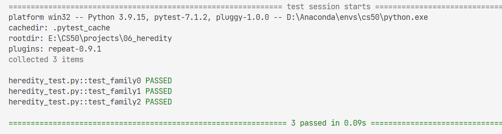

# 06_Heredity

Write an AI to assess the likelihood that a person will have a particular genetic trait.

knowledge related:

- **[Bayesian Network](../notes/lecture2.md/#27-bayesian-networks)** 

- **[Inference by Enumeration](../notes/lecture2.md/#2711-inference-by-enumeration)**

## 06.1 Background

**note:**
-  After a gene is passed on, though, it has some probability of **undergoing additional mutation**: changing from a version of the gene that causes hearing impairment to a version that doesn’t, or vice versa.

We can attempt to model all of these relationships by forming a **Bayesian Network** of all the relevant variables, as in the one below, which considers a family of two parents and a single child.


Each person in the family has a **Gene random variable** representing how many copies of a particular gene (e.g., the hearing impairment version of GJB2) a person has: a value that is 0, 1, or 2. Each person in the family also has a **Trait random variable**, which is yes or no depending on whether that person expresses a trait (e.g., hearing impairment) based on that gene. There’s an arrow from each person’s Gene variable to their Trait variable to encode the idea that **a person’s genes affect the probability that they have a particular trait**. Meanwhile, there’s also an arrow from both the mother and father’s Gene random variable to their child’s Gene random variable: **the child’s genes are dependent on the genes of their parents**.


## 06.2 task

Your task in this project is to use this model to **make inferences about a population**. **Given** information about people, **who their parents are**, and whether they have a particular **observable trait** (e.g. hearing loss) caused by a given gene, your AI will **infer the probability distribution for each person’s genes**, as well as **the probability distribution for whether any person will exhibit the trait in question**.

Recall from lecture that we can calculate a conditional probability by **summing up** all of the joint probabilities that **satisfy the evidence**, and then **normalize** those probabilities so that they each sum to 1.

note:
- how to cal the joint probability. **Enumeration**
- avoid lots of if else, **using the dict**
- update, add the prob to the **specific case**

res:


## 06.3 Example Joint Probability
To help you think about how to calculate joint probabilities, we’ve included below an example.

Consider the following value for people:
```py
{
  'Harry': {'name': 'Harry', 'mother': 'Lily', 'father': 'James', 'trait': None},
  'James': {'name': 'James', 'mother': None, 'father': None, 'trait': True},
  'Lily': {'name': 'Lily', 'mother': None, 'father': None, 'trait': False}
}

```

We will here show the calculation of joint_probability(people, {"Harry"}, {"James"}, {"James"}). Based on the arguments, one_gene is {"Harry"}, two_genes is {"James"}, and has_trait is {"James"}. This therefore represents the probability that: Lily has 0 copies of the gene and does not have the trait, Harry has 1 copy of the gene and does not have the trait, and James has 2 copies of the gene and does have the trait.

We start with Lily (the order that we consider people does not matter, so long as we multiply the correct values together, since multiplication is commutative). Lily has 0 copies of the gene with probability 0.96 (this is PROBS["gene"][0]). Given that she has 0 copies of the gene, she doesn’t have the trait with probability 0.99 (this is PROBS["trait"][0][False]). Thus, the probability that she has 0 copies of the gene and she doesn’t have the trait is 0.96 * 0.99 = 0.9504.

Next, we consider James. James has 2 copies of the gene with probability 0.01 (this is PROBS["gene"][2]). Given that he has 2 copies of the gene, the probability that he does have the trait is 0.65. Thus, the probability that he has 2 copies of the gene and he does have the trait is 0.01 * 0.65 = 0.0065.

Finally, we consider Harry. What’s the probability that Harry has 1 copy of the gene? There are two ways this can happen. Either he gets the gene from his mother and not his father, or he gets the gene from his father and not his mother. His mother Lily has 0 copies of the gene, so Harry will get the gene from his mother with probability 0.01 (this is PROBS["mutation"]), since the only way to get the gene from his mother is if it mutated; conversely, Harry will not get the gene from his mother with probability 0.99. His father James has 2 copies of the gene, so Harry will get the gene from his father with probability 0.99 (this is 1 - PROBS["mutation"]), but will get the gene from his mother with probability 0.01 (the chance of a mutation). Both of these cases can be added together to get 0.99 * 0.99 + 0.01 * 0.01 = 0.9802, the probability that Harry has 1 copy of the gene.

Given that Harry has 1 copy of the gene, the probability that he does not have the trait is 0.44 (this is PROBS["trait"][1][False]). So the probability that Harry has 1 copy of the gene and does not have the trait is 0.9802 * 0.44 = 0.431288.

Therefore, the entire joint probability is just the result of multiplying all of these values for each of the three people: 0.9504 * 0.0065 * 0.431288 = 0.0026643247488.