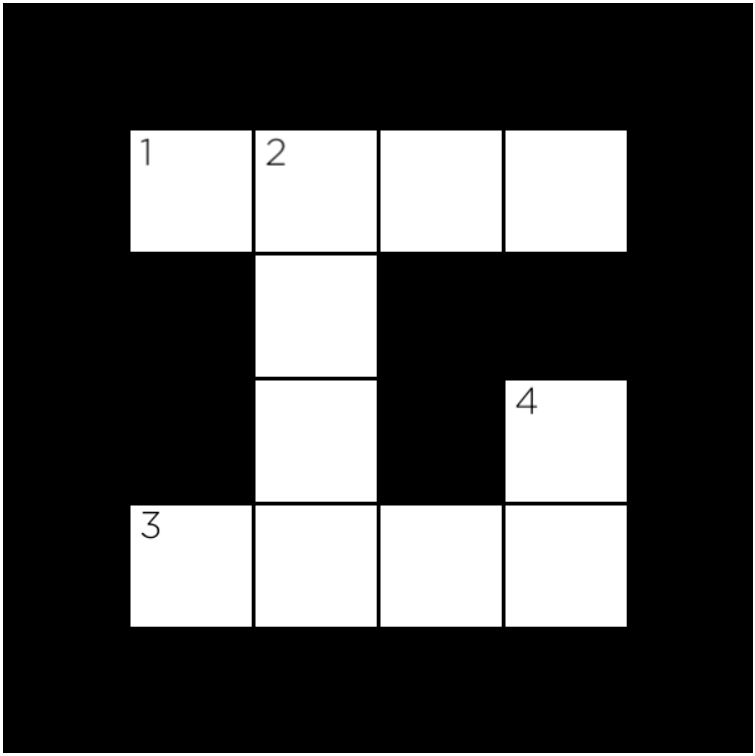
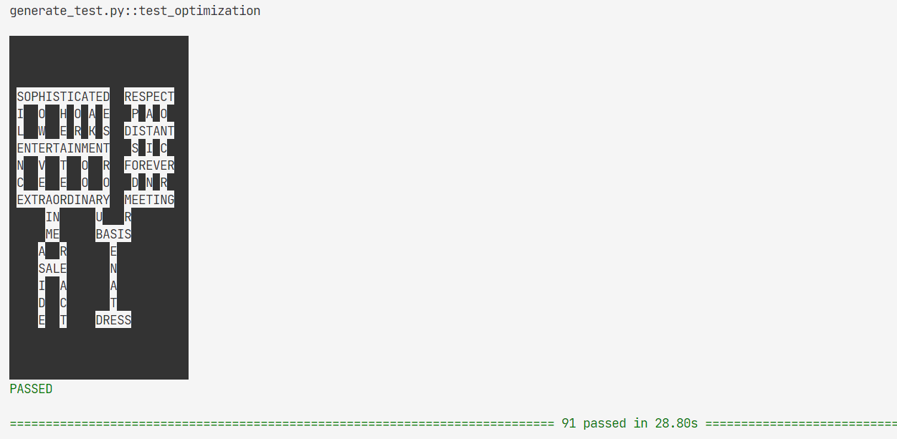

# 07_Crossword

Write an AI to generate crossword puzzles.

knowledge related:

- **[csp](../notes//lecture3.md#34-constraint-satisfaction)**

## 07.1 Background

We can model this sort of problem as **a constraint satisfaction problem**.

Consider the following crossword puzzle structure.

**big square with 6*6 pieces small squares (indexing from 0)**

In this structure, we have **four variables**, representing the four words we need to fill into this crossword puzzle (each indicated by a number in the above image).

cond:

1. **constraints**

   - Given the **structure** of a crossword puzzle (i.e., which squares of the grid are meant to be filled in with a letter).
   - **choosing** which words should go in each **vertical or horizontal** sequence of squares.
   - The **unary constraint** on a variable is given by its length. For Variable 1, for instance, the value BYTE would satisfy the unary constraint, but the value BIT would not (it has the wrong number of letters).

     Any values that don’t satisfy a variable’s unary constraints can therefore be **removed from the variable’s domain immediately**.
   - The **binary constraints** on a variable are given by **its overlap with neighboring variables**. Variable 1 has a single neighbor: Variable 2. Variable 2 has two neighbors: Variable 1 and Variable 3.

     We can represent that overlap as the character **index** in each variable’s word that must be the same character. For example, the overlap between Variable 1 and Variable 2 might be represented as the pair (1, 0), meaning that Variable 1’s character at index 1 necessarily must be the same as Variable 2’s character at index 0 (assuming 0-indexing, again).
   - For this problem, all words must be different: **the same word should not be repeated** multiple times in the puzzle.
2. **domain**

   - a list of **words** to use.
3. **variables**

   - **Each sequence of squares is one variable**, for **which we need to decide on its value** (which word in the domain of possible words will fill in that sequence).
   - Each variable is defined by four values: the **row it begins** on (its i value), the **column it begins** on (its j value), the **direction** of the word (either down or across), and the **length** of the word.

     for example, would be a variable represented by a row of **1** (assuming 0 indexed counting from the top), a column of **1** (also assuming 0 indexed counting from the left), a direction of across, and a length of 4.

## 07.2 task

The challenge ahead, then, is write a program to **find a satisfying assignment**: a different word (from a given vocabulary list) for each variable such that all of the unary and binary constraints are met.

note:

- the overlaps set include all possible combination between vars

  you may get `None` when try `overlaps[var1, var2]`
- the **binary constraints**, need to check the overlaps!
- **do remember to remove assignment, in the traceback.**
- do check the words is not duplicate before backtrace after assignment,
  otherwise the efficience is low, for checking the duplicate only when the assignment is complete.

perf:

1. add the inference, but no perf improvement.(**only the optimization test**)

    before:

    |   | real / s | user / s |
    | - | -------- | -------- |
    | 1 | 3.60     | 3.57     |
    | 2 | 3.49     | 3.46     |
    | 3 | 3.44     | 3.45     |
    | 4 | 3.48     | 3.45     |
    | 5 | 3.57     | 3.54     |

    after:

    |   | real / s | user/s |
    | - | -------- | ------ |
    | 1 | 3.59     | 3.57   |
    | 2 | 3.48     | 3.46   |
    | 3 | 3.35     | 3.34   |
    | 4 | 3.41     | 3.37   |
    | 5 | 3.40     | 3.37   |

2. TODO: **change the domains, when inferencing.**

res:

