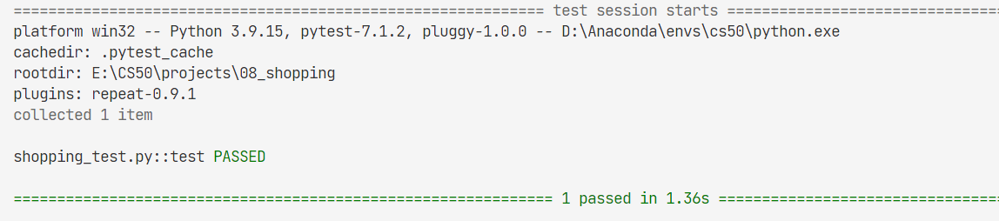

# 08_Shopping

Write an AI to predict whether online shopping customers will complete a purchase.

knowledge related:

- [nearest-neighbor-classification](../notes/lecture4.md/#41111-nearest-neighbor-classification)
- sensitivity
- specificity

## 08.1 Background

It might be useful, though, for a shopping website to be able to predict whether a user intends to make a purchase or not: perhaps **displaying different content to the user**, like showing the user **a discount offer** if the website believes the user isn’t planning to complete the purchase.

Your task in this problem is to build a **nearest-neighbor classifier** to solve this problem.

Your classifier won’t be perfectly accurate — perfectly modeling human behavior is a task well beyond the scope of this class — but **it should be better than guessing randomly**.

**How do we measure the accuracy of a system like this**? If we have a **testing data set**, we could run our classifier on the data, and compute what proportion of the time we correctly classify the user’s intent. This would give us a single accuracy percentage. But that number might be a little **misleading**.

Imagine, for example, if about 15% of all users end up going through with a purchase. A classifier that **always predicted** that the user would not go through with a purchase, then, we would measure as being 85% accurate: the only users it classifies incorrectly are the 15% of users who do go through with a purchase. And while 85% accuracy sounds pretty good, that doesn’t seem like a very useful classifier.

Instead, we’ll measure two values:
- sensitivity (also known as the “true positive rate”). predict-true positive / all positive
- specificity (also known as the “true negative rate”). predict-true negative / all negative

Sensitivity refers to the proportion of positive examples **that were correctly identified**: in other words, the proportion of users who did go through with a purchase who were correctly identified.
Specificity refers to the proportion of negative examples that were correctly identified: in this case, the proportion of users who did not go through with a purchase who were correctly identified.

So our “always guess no” classifier from before would have perfect specificity (1.0) but no sensitivity (0.0). Our goal is to build a classifier that performs **reasonably on both metrics**.

## 08.2 data

There are about **12,000** user sessions represented in this spreadsheet: represented as one row for **each user session**.

The first six columns measure the **different types of pages users have visited** in the session: the `Administrative`, `Informational`, and `ProductRelated` columns measure how many of those types of pages the user visited, and their corresponding _Duration columns measure how much time the user spent on any of those pages.

The `BounceRates`, `ExitRates`, and `PageValues` columns measure information from Google Analytics **about the page the user visited.**

`SpecialDay` is a value that measures **how close the date** of the user’s session is to a special day (like Valentine’s Day or Mother’s Day).

`Month` is an abbreviation of the month the user visited.

`OperatingSystems`, `Browser`, `Region`, and `TrafficType` are all integers describing information about the user themself.

`VisitorType` will take on the value `Returning_Visitor` for returning visitors and some other string value for non-returning visitors (`New_Visitor`).

`Weekend` is TRUE or FALSE depending on whether or not t**he user is visiting on a weekend.**

the `Revenue` column. This is the column that indicates whether the user ultimately made a purchase or not: TRUE if they did, FALSE if they didn’t.
This is the column that we’d like to learn to predict (the **“label”**), based on the values for all of the other columns (the **“evidence”**).

## 08.3 task

note:
- using built-in lib, calendar for month2num map
- type of data loaded from csv file, is `str`
- `pandas` may do type cast for you! so, you see the data type of them are int or float etc.

res:


```shell
Correct: 4067
Incorrect: 865
True Positive Rate: 37.75%
True Negative Rate: 90.54%
```