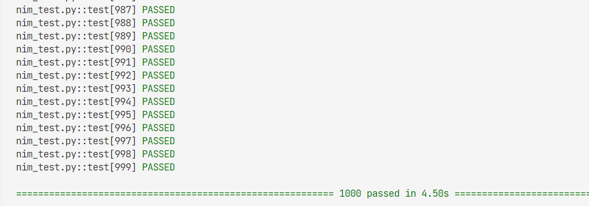

# 09_Nim

Write an AI that teaches itself to play Nim through reinforcement learning.

knowledge related:

- [reinforcement-learning](../notes//lecture4.md/#416-reinforcement-learning)

## 09.1 Background

Recall that in the game Nim, we begin **with some number of piles**, **each with some number of objects**.

Players take turns: on a player’s turn, the player removes **any non-negative number of objects** from any **one (only from this one pile)** non-empty pile. Whoever removes the last object loses.

There’s some **simple strategy** you might imagine for this game:
- if there’s only one pile and three objects left in it, and it’s your turn, your best bet is to remove two of those objects, leaving your opponent with the third and final object to remove. 
- But if there are more piles, the strategy gets considerably **more complicated.**

## 09.2 task

In this problem, we’ll build an AI to **learn the strategy** for this game through **reinforcement learning**. By **playing against itself repeatedly** and learning from experience, eventually our AI will learn which actions to take and which actions to avoid.

note:

- If lst is a list, then tuple(lst) can be used to convert lst into a tuple.

- you may assume it is a `list` of integers.
  
  Any time a function accepts an action as input,
  
- you may assume it is an integer pair (i, j) of a pile i and a number of objects j.

res:

## 09.3 guide

In particular, we’ll **use Q-learning** for this project. Recall that in Q-learning, we try to **learn a reward value (a number)** for every (state, action) pair.
- An action that loses the game will have a reward of -1
- an action that results in the other player losing the game will have a reward of 1
- an action that results in the game continuing has an immediate reward of 0

**Q-learning:**

$Q(s, a)_{i+1} \leftarrow \mathrm{Q}(s, a)_{i}+\alpha\left(\left(\mathrm{r}+\gamma \max _{a^{\prime}} \mathrm{Q}\left(\mathrm{s}^{\prime}, \mathrm{a}^{\prime}\right)\right)-\mathrm{Q}(s, a)_{i}\right)$

**state and action:**
- A “state” of the Nim game is just the current size of all of the piles.
    
    A state, for example, might be [1, 1, 3, 5], representing the state with 1 object in pile 0, 1 object in pile 1, 3 objects in pile 2, and 5 objects in pile 3.
- An “action” in the Nim game will be a pair of integers (i, j), representing the action of taking j objects from pile i.
    
    So the action (3, 5) represents the action “from pile 3, take away 5 objects.” Applying that action to the state [1, 1, 3, 5] would result in the new state [1, 1, 3, 0] (the same state, but with pile 3 now empty).