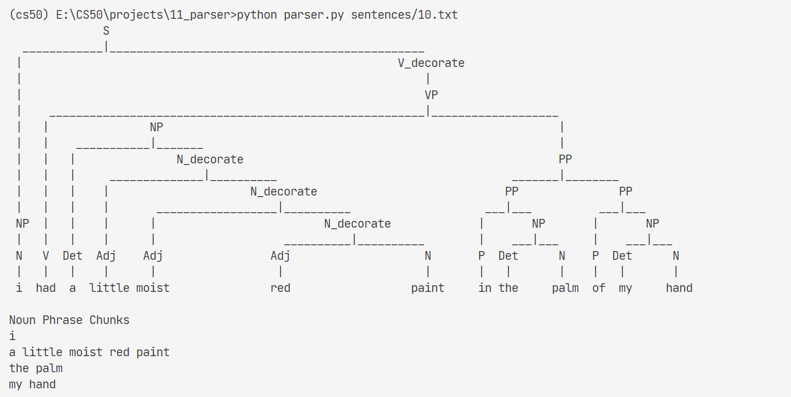

# 11_Parser

Write an AI to parse sentences and extract noun phrases.

knowledge related:

- [CTF](../notes//lecture6.md/#62-context-free-grammar)

## 11.1 Background

A common task in natural language processing is parsing, the process of determining the structure of a sentence. 

This is useful for a number of reasons: 
- knowing the structure of a sentence can help a computer to better understand the meaning of the sentence, 
- and it can also help the computer **extract information** out of a sentence. In particular, it’s often useful to extract noun phrases out of a sentence to get an understanding for what the sentence is about.

**Top-Down:**

In this problem, we’ll use the **context-free grammar** formalism to parse English sentences to determine their structure.

Recall that in a context-free grammar, we repeatedly apply rewriting rules to transform symbols into other symbols.

The objective is to start with a nonterminal symbol S (representing a sentence) and repeatedly apply context-free grammar rules until we generate a complete sentence of terminal symbols (i.e., words).

The rule S -> N V, for example, means that the S symbol can be rewritten as N V (a noun followed by a verb). If we also have the rule N -> "Holmes" and the rule V -> "sat", we can generate the complete sentence "Holmes sat.".

Of course, noun phrases might not always be as simple as a single word like "Holmes". We might have noun phrases like "my companion" or "a country walk" or "the day before Thursday", which require more complex rules to account for. To account for the phrase "my companion", for example, we might imagine a rule like:

`NP -> N | Det N`

In this rule, we say that an NP (a “noun phrase”) could be either just a noun (N) or a **determiner (Det)** followed by a noun, where **determiners** include words like "a", "the", and "my". The vertical bar (|) just indicates that there are multiple possible ways to rewrite an NP, with each possible rewrite separated by a bar.

To incorporate this rule into how we parse a sentence (S), we’ll also need to modify our `S -> N V` rule to allow for noun phrases (NPs) as the subject of our sentence. See how? And to account for more complex types of noun phrases, we may need to modify our grammar even further.

## 11.2 task

1. Editing the NONTERMINALS rules so that all of the sentences can be parsed will be up to you!
2. Each rules must be on its own line
3. your first rule **must begin with S** -> since S (representing a sentence) is the starting symbol.
4. You may add as many nonterminal symbols as you would like.
5. It’s to be expected that your parser may generate some sentences that you believe are not syntactically or semantically well-formed.

    - You need not worry, therefore, if your parser allows for parsing meaningless sentences like **"His Thursday chuckled in a paint."**
    - That said, you should avoid over-generation of sentences where possible. For example, your parser should definitely **not accept** sentences like **"Armchair on the sat Holmes."**
    - You should also avoid under-generation of sentences. A rule like S -> N V Det Adj Adj Adj N P Det N P Det N would technically successfully generate sentence 10, but not in a way that is particularly useful or generalizable.
    - The rules in the lecture source code are (intentionally) a very simplified rule set, and as a result may suffer from over-generation. You can (and should) make modifications to those rules to try to be as general as possible without over-generating.
        
        In particular, consider how you might get your parser to accept the sentence **“Holmes sat in the armchair.”** (and **“Holmes sat in the red armchair.”** and **“Holmes sat in the little red armchair.”**), but have it **not accept** the sentence **“Holmes sat in the the armchair.”**

res:

