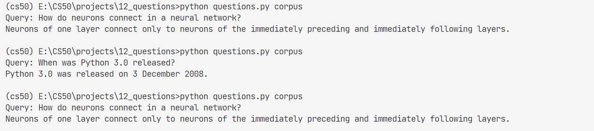

# 12_Questions

Write an AI to answer questions.

knowledge related:

- [information-retrieval](../notes//lecture6.md/#652-information-retrieval)
- [tf-idf](../notes//lecture6.md/#6521-tf-idf)

## 12.1 Background

Question Answering (QA) is a field within natural language processing focused on designing systems that **can answer questions**. 

Among the more famous question answering systems is **Watson**, the IBM computer that competed (and won) on Jeopardy!.

A question answering system of Watson’s accuracy requires enormous complexity and vast amounts of data, but in this problem, we’ll design a very simple question answering system based on **inverse document frequency.**

Our question answering system will perform two tasks: **document retrieval** and **passage retrieval**. Our system will have access to a corpus of text documents.

When presented with a **query** (a question in English asked by the user),
- document retrieval will first identify which document(s) are most relevant to the query.
- Once the **top documents** are found, the top document(s) will be **subdivided** into passages (**in this case, sentences**) so that the most relevant passage to the question can be determined.

How do we find the most relevant documents and passages?

To find the most relevant documents, we’ll use **tf-idf** to rank documents based both on **term frequency** for words in the query as well as **inverse document frequency** for words in the query.

Once we’ve found the most relevant documents, there many possible metrics for **scoring passages**, but we’ll use a combination of inverse document frequency and a query term density measure (described in the Specification).

**More sophisticated question answering systems** might employ other strategies (analyzing the type of question word used, looking for synonyms of query words, lemmatizing to handle different forms of the same word, etc.) but we’ll leave those sorts of improvements as exercises for you to work on if you’d like to after you’ve completed this project!

## 12.2 task

note:
1. Different sources may use different formulas to calculate term frequency and inverse document frequency than the ones described in lecture and given in this specification. Be sure that the formulas you implement are the ones described in this specification.
2. In the compute_idfs function, recall that the documents input will be represented as a dictionary **mapping document names to a list of words** in each of those documents. The **document names themselves are irrelevant to the calculation of IDF values**. That is to say, changing any or all of the document names should not change the IDF values that are computed.
3.  be platform-independent: that is to say, it should work regardless of operating system. Note that on macOS, the / character is used to separate path components, while the \ character is used on Windows. Use `os.sep` and `os.path.join` as needed instead of using your platform’s specific separator character.

res:
